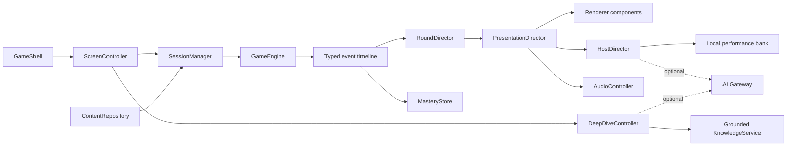
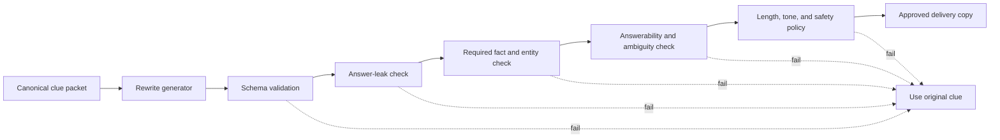
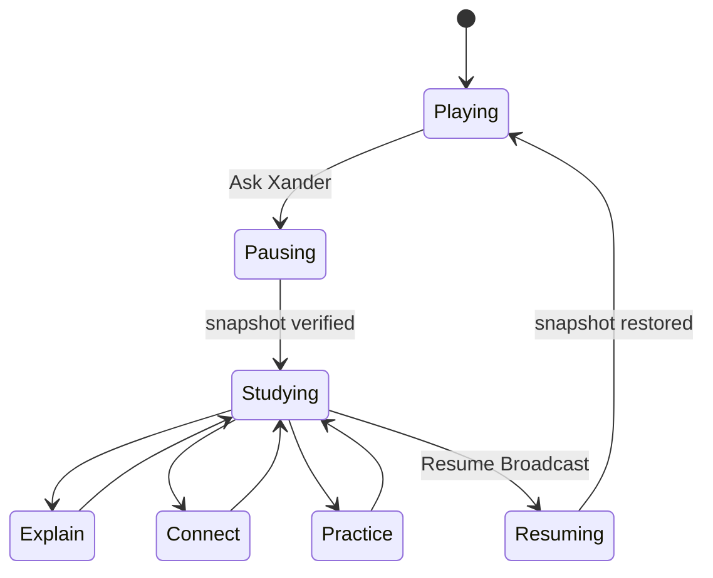

# JeoPARODY Architecture Convergence and AI Host Plan

**Date:** 2026-07-17  
**Status:** Recommended target architecture  
**Scope:** Styling, runtime coordination, AI host performance, clue rewriting, study mode, and generated trivia

This document consolidates the current styling audit, engine contracts, host roadmap, Deep Dive Dojo plan, creative bible, and production plan. It does not replace the creative bible or detailed module contracts. It establishes the order in which those ideas become one production system.

## Executive Verdict

JeoPARODY has a real identity, a deterministic game core, a finite episode foundation, and unusually strong raw material. Its primary risk is now convergence.

The app has accumulated several good generations of design and planning faster than it has retired their implementation layers. The same pattern could repeat with AI: a clever host endpoint could become another impressive layer sitting above an unclear truth, state, and presentation model.

The production move is not a framework rewrite. It is to make five boundaries explicit:

1. **Canonical truth:** immutable clue, answer, accepted-answer, source, and scoring data.
2. **Game state:** deterministic episode, round, score, pause, resume, and mastery behavior.
3. **Performance:** host dialogue, jokes, poses, audio cues, and optional clue delivery.
4. **Learning:** grounded explanations, retrieval practice, citations, and review scheduling.
5. **Presentation:** a layered styling system whose component and responsive ownership can be tested.

Everything generated by AI belongs in performance or learning. It never silently crosses into canonical truth or ranked scoring.

## Measured Reality

| Area | Current evidence | Architectural consequence |
| --- | --- | --- |
| Runtime CSS | `style.css` plus `styles/game.css`: 5,180 lines after the latest pass | File separation exists, but component ownership is not yet physical |
| Cascade debt | 51 duplicate selectors in the same cascade context; 5 accessibility `!important` declarations | The audit is a useful ratchet, but the next target must decrease the baseline |
| Responsive model | Multiple viewport media-query generations style embedded and standalone cabinets | Cabinet behavior should respond to its own container, not only the browser viewport |
| Coordinator size | `app.js`: 852 lines | Clue pipeline, preferences, host direction, and screen flow need dedicated owners |
| Renderer size | `renderer.js`: 952 lines | DOM binding, view-model formatting, media, modal, and visual state are coupled |
| Host system | Strong local performance states, skins, and quip banks | Good fallback layer; missing an asynchronous `HostDirector` contract |
| Question payload | Two 53 MB JSON files and two 33 MB CSV files under `questions/` | The raw archive is source material, not an acceptable first-load product payload |
| Static build | Roughly 90-97 MB depending on filesystem accounting | Content packaging dominates startup cost |
| Round flow | `RoundDirector` has cancellable generation tokens and deterministic beats | Correct foundation for pause/resume and non-blocking AI work |
| Study plan | Deep Dive Dojo already defines snapshot and grounding boundaries | Implement pause and grounded packets before conversational AI |

## Expert Council Recommendations

### Systems and Carmack Lens

1. Keep the deterministic core small enough to understand in one sitting.
2. Make invalid state transitions impossible or loudly observable.
3. Record one serializable event timeline that can reproduce a round.
4. Never put network latency on the critical path to showing a clue or judging an answer.
5. Optimize the 53 MB data load before micro-optimizing animation code.
6. Prefer incremental extraction over a big-bang framework migration.
7. Build deterministic fixtures for every important visual and gameplay state.

The important Carmack-style simplification is this: the game should remain fully playable when translation, AI, voice, telemetry, remote media, and study services are all unavailable.

### Design Systems Lens

1. Use explicit cascade layers so source order communicates intent.
2. Replace viewport-only cabinet breakpoints with container queries.
3. Separate primitive tokens from semantic theme and component tokens.
4. Give each component one source file and one responsive owner.
5. Build a visual state laboratory instead of manually manufacturing states during every review.
6. Treat the landing site, game cabinet, and creative tools as related products with different density, not one universal component sheet.

### Game Direction Lens

1. One primary action should dominate each round phase.
2. Host speech should be paced like a performance beat, not continuous chat.
3. Jokes need a frequency budget; constant jokes flatten surprise and slow play.
4. Study mode should feel like opening a secret room in the same world, not leaving the game for a chatbot.
5. Generated content should first appear in unranked practice, never in the scored episode.

### AI Systems Lens

1. Define separate schemas for banter, clue delivery, coaching, and generated trivia.
2. Version prompts, host profiles, content packets, validators, and model choices.
3. Cache episode-level generation before play whenever possible.
4. Stream optional dialogue, but render a local fallback immediately.
5. Treat clues, sources, player text, and retrieved pages as untrusted data, not instructions.
6. Log fidelity, latency, fallback, moderation, citation, and cost outcomes with correlation IDs.

### Learning Science Lens

1. Replace endless explanation with a short loop: diagnose, explain, retrieve, connect, schedule review.
2. Ask for confidence before revealing the answer when appropriate.
3. Store mastery by concept, not only by clue id.
4. Interleave missed concepts into later episodes.
5. Reward successful retrieval after delay more than rereading.

### Trust, Safety, and IP Lens

1. Canonical facts and scoring never come from host prose.
2. Every study claim should resolve to an approved source or explicit uncertainty.
3. Generated questions require validation before use.
4. Host profiles use broad original voice traits, not instructions to imitate a living or deceased performer.
5. Public builds should converge on original host art and voice assets.

## Target Styling Architecture

### The Key Change

The current split into shared and game CSS was the correct first move. The next move is component ownership enforced by files, layers, and tests.

```text
styles/
  order.css                 # Declares layer order only
  tokens/
    primitives.css          # Raw palette, type scale, spacing, radii, durations
    semantics.css           # surface, text, border, focus, success, danger
    themes.css              # day, night, high contrast
  foundation/
    reset.css
    fonts.css
    accessibility.css
  site/
    shell.css
    editorial.css
    landing-components.css
  game/
    cabinet.css
    scene.css
    header.css
    scoreboard.css
    menu.css
    dialogue.css
    host.css
    controls.css
    media.css
    payoff.css
  utilities/
    visibility.css
    motion.css
```

The first file declares:

```css
@layer reset, tokens, base, layout, components, variants, states, responsive, utilities;
```

Every source file writes into a named layer. A component cannot win by being appended at the bottom of a redesign block.

### Token Model

Use three levels:

1. **Primitive:** `--jp-blue-700`, `--jp-space-3`, `--jp-duration-fast`.
2. **Semantic:** `--jp-surface-panel`, `--jp-text-primary`, `--jp-focus-ring`.
3. **Component:** `--dialogue-tail`, `--score-digit`, `--control-face`.

Themes should change semantic tokens. They should not invert ambiguous primitives such as `--paper` from light paper to dark text.

### Container-Driven Cabinet

The embedded cabinet and standalone cabinet share markup but do not share available space. Put size containment on the game surface:

```css
.game-container {
  container: cabinet / size;
}
```

Then define compact, portrait, standard, and wide compositions with `@container cabinet (...)`. Viewport queries remain only for page-level concerns such as safe areas and browser chrome.

This directly eliminates a class of bugs where a narrow cabinet inside a wide landing page receives desktop styling.

### Component Contract

Each component owns:

- base structure;
- semantic variants;
- interaction states;
- theme token consumption;
- container-query behavior;
- reduced-motion behavior;
- a deterministic visual fixture.

IDs remain JavaScript hooks and accessibility references, not styling APIs. Player-visible states use documented attributes such as `data-round-phase`, `data-game-moment`, and `data-dialogue-style`.

### Visual State Lab

Create `visual-fixtures.html` or a fixture route that can deterministically render:

- loading, clue, media, reveal, judging, correct, incorrect, completion;
- all dialogue skins;
- menu open and scoreboard expanded;
- day, night, reduced motion, high contrast;
- English, Portuguese, long clue, broken media, and offline fallback;
- host states and transparent-asset failures.

Capture at minimum:

| Fixture | Sizes |
| --- | --- |
| Phone portrait | 320x568, 390x844 |
| Tablet portrait | 768x1024 |
| Compact landscape | 1024x768 |
| Desktop | 1440x900 |
| Tall cabinet | 807x1189 |

The release gate compares screenshots, checks overflow, and records geometry for dialogue, host, scoreboard, and footer. Manual review remains important, but state setup stops being manual.

### CSS Migration Strategy

Use a strangler migration, one component at a time:

1. Add layer declaration, token files, and a no-regression fixture harness.
2. Migrate header, scoreboard, and menu together because they share geometry.
3. Migrate host and footer together because they share the lower-stage boundary.
4. Migrate dialogue and payoff together because payoff reuses dialogue skins.
5. Migrate scene and media.
6. Namespace landing-only generic selectors.
7. Delete the migrated blocks from `styles/game.css` immediately.

The duplicate-selector budget becomes a ratchet: every migration must reduce the baseline; no change may raise it.

## Target Runtime Architecture



### Recommended Extractions

| Current owner | Extract | Responsibility |
| --- | --- | --- |
| `app.js` | `ApplicationController` | Startup and dependency wiring only |
| `app.js` | `CluePipeline` | Candidate selection, media health, translation, rewrite selection, cancellation |
| `app.js` | `PreferenceStore` | Versioned settings, migration, persistence |
| `app.js` | `PresentationDirector` | Maps deterministic events to host, audio, renderer, and timing beats |
| `renderer.js` | Component renderers | Header, scoreboard, dialogue, host, controls, media, study panel |
| full archive loader | `ContentRepository` | Manifest, curated packs, lazy shards, schema validation |
| local host manager | `HostDirector` | Local-first performance selection and optional AI requests |

Do not create abstractions merely to shorten files. Each extraction must remove a distinct reason to change.

### Event and State Improvements

- Add `PAUSING`, `PAUSED`, and `RESUMING` round phases.
- Add study events, host-generation events, and fidelity outcomes.
- Give every round a `roundId` and every async request a `correlationId`.
- Persist an append-only, privacy-safe round event summary for replay and debugging.
- Generate renderer view models from state rather than letting orchestration format DOM copy.
- Move to native ES modules incrementally after the ownership extraction; do not combine this with a UI rewrite.

## AI Host Architecture

### Four Different Products, Four Schemas

Do not use one free-form `generateHostText()` function.

#### 1. `HostBeat`

Short performance response to a known game event.

```json
{
  "kind": "banter",
  "event": "answer_incorrect",
  "text": "No. A confident little expedition, though.",
  "emotion": "deadpan",
  "animationCue": "bureaucratic-disappointment",
  "audioCue": "sting-soft",
  "maxDisplayMs": 2400,
  "profileVersion": 3
}
```

#### 2. `ClueDelivery`

Optional paraphrase beside an immutable canonical clue.

```json
{
  "kind": "clue_delivery",
  "canonicalClueId": "season-zero-004",
  "deliveryText": "...",
  "requiredFactsPreserved": ["..."],
  "answerLeak": false,
  "fidelity": "passed",
  "validatorVersion": 2
}
```

#### 3. `CoachResponse`

Grounded explanation with claim-level citations, uncertainty, and suggested learning actions.

#### 4. `TriviaCandidate`

An unpublished question candidate with source claims, answer, accepted-answer rules, difficulty estimate, and validation results.

These outputs have different latency, safety, caching, and quality requirements. Keeping them separate prevents a witty line from accidentally becoming a fact contract.

### Host Profile

The host profile should contain bounded data, not a raw system prompt:

- voice traits and cadence;
- humor intensity and joke budget;
- allowed motifs and story-canon references;
- teaching strategy and reading level;
- boundaries and sensitive-topic policy;
- visual, animation, and voice pack ids;
- profile and prompt versions.

The story mystery needs a `LoreLedger`: approved facts, secrets, reveal conditions, and forbidden contradictions. AI can riff on unlocked lore but cannot invent host canon.

### Non-Blocking Latency Ladder

1. **0 ms:** local quip and deterministic animation cue.
2. **Cache hit:** replace or extend the local beat if it arrives before the performance window closes.
3. **Fast generation:** stream optional text without blocking clue input.
4. **Late result:** cache it for a future callback; never interrupt the current round.
5. **Failure:** keep the local performance and record a fallback event.

Pre-generate likely beats and clue deliveries for a finite episode. Live generation should be reserved for player-specific moments and study follow-ups.

### Clue Rewrite Fidelity Pipeline



The UI must retain a one-action **Original wording** control. Scoring always uses the canonical answer and accepted-answer policy.

### Gateway Contract

Use a server-side worker or serverless gateway with:

- provider abstraction and model allowlist;
- JSON schema validation;
- prompt/profile/content versioning;
- request cancellation and strict timeouts;
- rate, cost, and abuse limits;
- moderation for player input and generated output;
- encrypted secrets and no browser API key;
- cache keys containing content revision, locale, host version, intent, prompt version, and model version;
- structured logs without full private conversations by default.

## Study Mode Architecture

### Product Shape

Study mode is a reversible round state, not a separate chatbot page.



### Structured Learning Loop

The default experience should offer useful actions before a blank text box:

1. **Why is that the answer?**
2. **Explain it simply.**
3. **Give me the backstory.**
4. **Compare it with something similar.**
5. **Quiz me without giving it away.**
6. **Save this for review.**

After explanation, the coach should ask for retrieval or application. A good session is a short learning loop, not maximum message count.

### Required Modules

- `DeepDiveController`: lifecycle, cancellation, and resume token.
- `RoundSnapshot`: versioned, serializable, single-use resume contract.
- `GroundedCluePacket`: canonical clue, answer policy, explanation, sources, entities, media health, locale.
- `KnowledgeService`: approved retrieval and claim-level source mapping.
- `CoachGateway`: optional generated explanation and Socratic follow-up.
- `MasteryStore`: concept observations, confidence, review schedule, and privacy controls.
- `StudyPanelRenderer`: side sheet on desktop, full-height sheet on mobile.

The detachable window remains an enhancement implemented with `BroadcastChannel`, heartbeat, and ownership token. Closing it leaves the main game safely paused.

### Generated Trivia Along the Way

Generated trivia should enter an unranked **Practice Lab** pipeline:

```mermaid
flowchart LR
    topic["Grounded topic packet"] --> candidate["Generate candidate"]
    candidate --> citations["Resolve supporting citations"]
    citations --> verify["Fact and answer verification"]
    verify --> ambiguity["Ambiguity and leakage tests"]
    ambiguity --> duplicates["Duplicate and similarity check"]
    duplicates --> difficulty["Difficulty estimate"]
    difficulty --> practice["Unranked practice question"]
    practice --> feedback["Player feedback and telemetry"]
    feedback -. reviewed promotion .-> curated["Curated content pack"]
```



No generated candidate enters ranked scoring merely because another model says it looks correct. Promotion to curated content requires deterministic schema checks and human or trusted editorial review.

## Outside-the-Box Product Sparks

### High-Leverage, Near-Term

1. **Show the receipts:** the host can dramatize a clue, but one control opens canonical wording, accepted-answer policy, explanation, and sources.
2. **Ninety-second rabbit hole:** after a reveal, offer one compact story, one surprising connection, and one retrieval question before resuming.
3. **Ruling appeal:** a player can challenge fuzzy grading. The host performs the hearing; a deterministic answer-policy service makes the ruling.
4. **Callback memory:** the host may reference events from the current episode, with a strict callback and joke budget.
5. **Concept postcards:** completing a deep dive produces a collectible visual summary that returns in spaced review.

### Distinctive Mid-Term

1. **The Lore Ledger:** Xander's mystery advances through authored evidence unlocked by episode behavior, not random AI invention.
2. **Dojo ladder:** explain, distinguish, apply, create an example, retrieve later. Each rung changes the host pose and room treatment.
3. **Knowledge-map episodes:** categories become connected neighborhoods; missed concepts visibly form routes for future episodes.
4. **Bilingual spotlight:** Portuguese delivery can reveal aligned English phrases on focus or hover, then quiz recognition in both directions.
5. **Host rehearsal room:** creators test a host profile against fixed safety, humor, teaching, and latency fixtures before activation.

### Experimental

1. **Counterfactual workshop:** the coach changes one historical variable and asks the player to reason about consequences, clearly labeled as hypothetical.
2. **Player-as-writer:** after learning a topic, the player drafts a clue; the system critiques ambiguity and answer leakage.
3. **Broadcast interference:** story events alter presentation and host confidence while canonical clue readability remains protected.
4. **Local host brain:** an offline bank of templated callbacks, explanations, and performance rules keeps the character alive without cloud AI.
5. **Episode director:** a planning model assembles an arc from already validated content, balancing topic, difficulty, callbacks, and review needs.

## Lead Domino Sequence

### Domino 1: Styling Foundation and Visual Lab

- Add cascade layer order and semantic token files.
- Build deterministic visual fixtures and screenshot geometry checks.
- Migrate header/score/menu first.
- Introduce cabinet container queries.
- Ratchet duplicate selectors below 40 during this slice.

**Why first:** visual work remains expensive and risky until the cascade has enforceable ownership. The fixture lab also protects every later study and AI screen.

### Domino 2: Curated Clue Packet and Pause Contract

- Define versioned `CanonicalCluePacket` and `GroundedCluePacket` schemas.
- Add explanation, sources, entities, accepted answers, and media metadata to Season Zero.
- Add `PAUSED` phases and tested `RoundSnapshot` restore.
- Ship the study panel with deterministic content only.

**Why second:** this creates trustworthy study mode before any model is invited into the room.

### Domino 3: Local-First Host Director

- Extract `PresentationDirector` and `HostDirector` from `app.js`.
- Define `HostBeat` and profile schemas.
- Add joke budget, callback memory, lore ledger, and deterministic fallbacks.
- Route visual, text, and audio performance through one cue contract.

### Domino 4: Secure AI Gateway and Clue Delivery

- Add the gateway, schema validation, observability, caching, and timeouts.
- Pre-generate episode banter and clue deliveries.
- Add fidelity gates and original-wording fallback.
- Keep generation off the gameplay critical path.

### Domino 5: Conversational Study and Practice Lab

- Add grounded free-form follow-ups and citations.
- Add mastery observations and spaced review.
- Add validated, unranked generated trivia.
- Add detachable window synchronization only after in-cabinet pause/resume is proven.

### Domino 6: Content and Runtime Packaging

- Replace the full archive load with a manifest, curated packs, and lazy shards.
- Remove duplicate raw datasets from production output.
- Self-host approved fonts.
- Add performance budgets and fail builds that regress first-clue time or asset size.

## Concrete Release Gates

### Styling

- One selector per component per cascade context.
- Duplicate baseline decreases with every migrated component.
- No ID selectors in new component styling.
- All visual fixtures pass at supported sizes and both themes.
- Embedded and standalone cabinets respond correctly to their own container.

### Runtime

- A recorded round event timeline reproduces the same visible outcome.
- Pause/resume preserves clue, input, score, streak, answer visibility, focus, and timer state.
- Network-service failure cannot block clue display or answer judgment.
- `app.js` becomes dependency wiring and high-level coordination rather than feature ownership.

### AI Host

- Every output validates against its intent-specific schema.
- Clue delivery has automatic original fallback.
- Host dialogue cannot mutate engine or session state.
- P95 optional host response latency, fallback rate, and cost are observable.
- Repeated jokes, story contradictions, answer leakage, and uncited study claims have automated tests.

### Learning

- Every study-enabled clue has explanation and sources without AI.
- Generated explanations identify uncertainty and cite claims.
- Practice Lab questions are unranked and visibly labeled generated until curated.
- Mastery data is inspectable, clearable, and limited to learning behavior.

## Explicit Non-Goals During Convergence

- No React or framework rewrite merely to reorganize CSS.
- No AI-generated scoring decisions.
- No live model request required to start or finish a round.
- No raw prompt editor in ordinary player settings.
- No generated trivia in ranked episodes.
- No detachable coach window before in-cabinet pause/resume is reliable.
- No new equal-weight visual skin until canonical components and fixtures exist.

## First Implementation Ticket

Build the **Visual State Lab plus cascade-layer skeleton** without changing the current rendered design.

Acceptance criteria:

1. Deterministic fixtures cover clue, reveal, correct, incorrect, menu, scoreboard, day, night, and mobile.
2. Screenshot and geometry checks run from one command.
3. Layer order and semantic tokens are loaded by both game shells.
4. Header, scoreboard, and menu move into canonical component files.
5. Their old declarations are removed from `styles/game.css` in the same change.
6. CSS duplicate selectors decrease from 51; they do not merely move files.
7. Unit tests, CSS audit, static shell tests, and production build remain green.

That is the next lead domino because it changes the cost of every future visual and product feature. The pause contract and grounded clue packet should begin immediately after it, using the new fixture system for the first study-mode screens.
