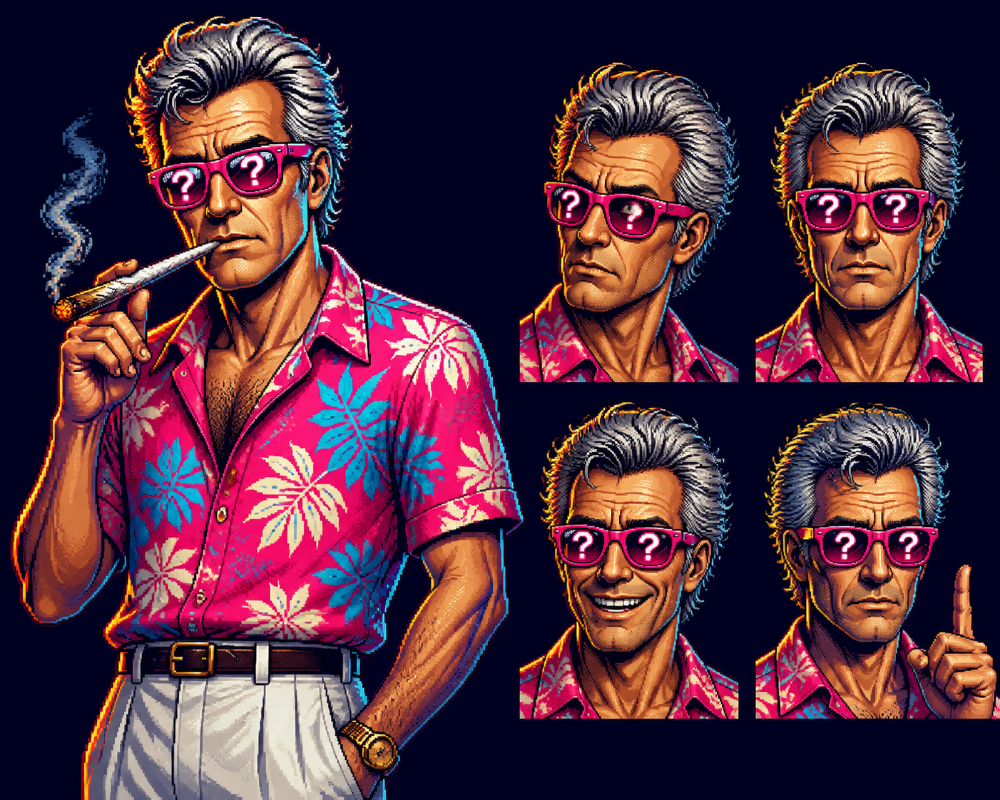
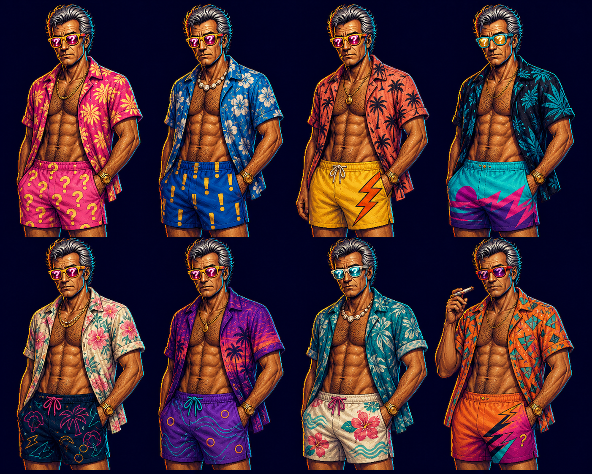
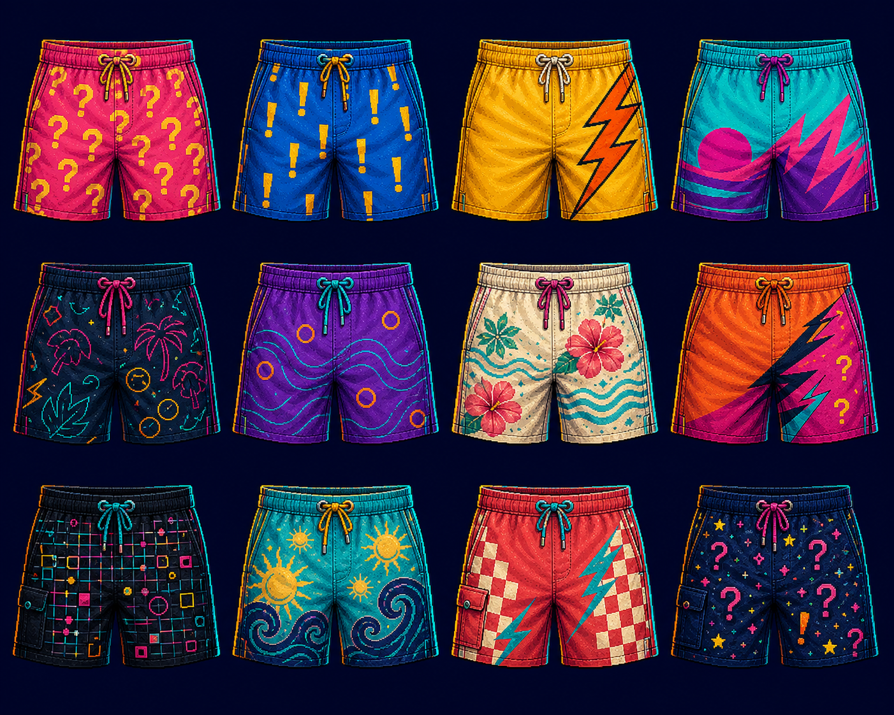
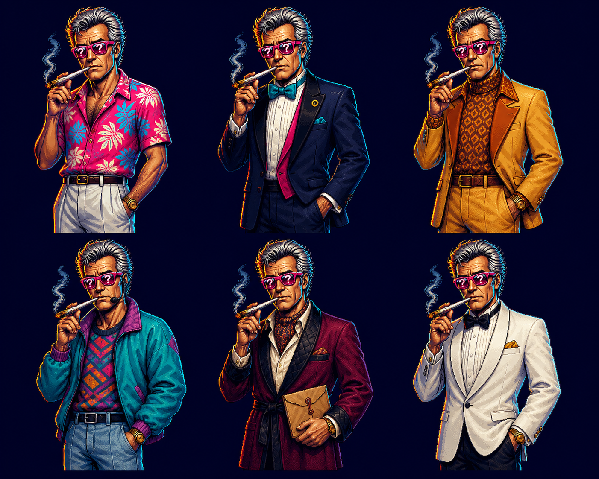
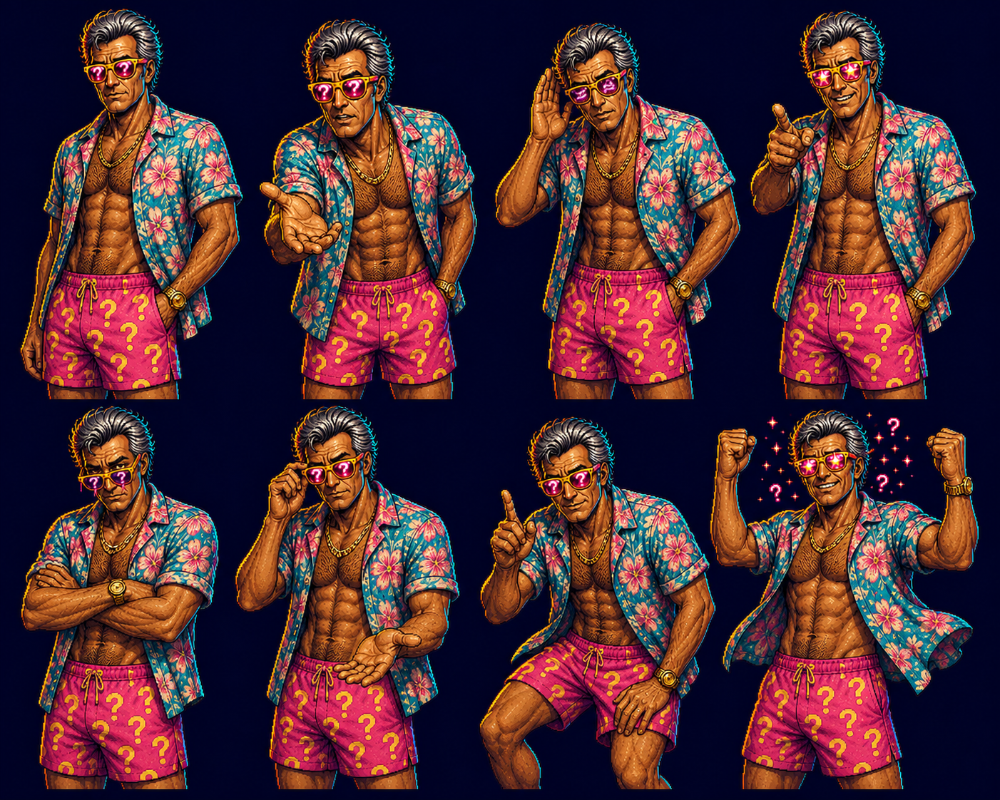

# JeoPARODY Character Art Direction

**Status:** canonical visual direction

**Updated:** 2026-08-07

## The Decision

All JeoPARODY character artwork should inherit the visual DNA of the existing
`trebek-dope` host set, then be rebuilt with deliberate premium pixel craft.
The goal is not to paste a pixel filter over the current illustrations. The
goal is to preserve their peculiar faces, loud color, graphic-novel confidence,
and deadpan attitude while redrawing them on a coherent pixel grid.

The first direction board is:

The approved everyday wardrobe direction and first board-short textile catalog
are:

The approved special-event wardrobe remains part of the same collection:

This is a style target and identity study, not a production sprite sheet. It
still needs pixel cleanup, pose separation, transparent extraction, and a final
identity pass before runtime use.

## Canonical Reference Hierarchy

1. `assets/trebek/trebek-dope-01.png` owns the strongest overall silhouette,
   hair sweep, graphic polish, shirt energy, and confident asymmetry.
2. `assets/trebek/trebek-dope-03.png` owns the most useful facial caricature,
   suspicious brow, age, and dry expression.
3. `assets/trebek/trebek-dope-05.png` owns the clearest question-mark glasses,
   centered readability, and weathered deadpan mood.
4. `assets/trebek/trebek-dope-02.png` is a useful frontal-expression reference,
   but the forehead symbol is a situational gag rather than anatomy.

When references disagree, preserve recognizability and attitude before costume
detail. No single AI variation gets to redefine the character.

## Xander Identity Lock

The main host should retain these invariants in every pose and costume:

- late-middle-aged to older face with visible history, not a generic young hero;
- tall, angular head with a long nose, high forehead, and tired intelligent brow;
- a lean, weathered surfer build with restrained definition, never a widened
  bodybuilder or superhero reinterpretation;
- thick silver hair swept upward and back, with dark indigo interior shadows;
- hot-pink wayfarer frames with simple question-mark or scene reflections;
- dry resting expression that can turn delighted without becoming a different
  person;
- loud tropical tailoring in coral, pink, turquoise, cream, and deep navy;
- a torso extending at least to the waist so the character can stand behind
  the cabinet footer;
- slightly disreputable details carried with complete dignity.

The cigar or joint, halo, forehead mark, microphone, drink, and other props are
performance vocabulary. They appear only when the scene calls for them. They
are not permanent identity features.

## Core Wardrobe Lock

Xander's default wardrobe is beach-idol broadcast attire, not conventional
game-show tailoring. His instantly readable everyday silhouette is:

- custom board shorts in a loud, beautifully controlled print;
- a vintage Hawaiian or camp shirt worn completely or mostly unbuttoned;
- a fit, weathered torso with visible chest hair;
- silver swept hair and bright yellow wayfarer-style frames;
- mirrored hot-pink lenses, usually carrying clean question-mark reflections;
- one or two restrained accessories such as a gold watch, chain, shell necklace,
  ring, or surf leash.

The primary glasses are yellow frames with pink mirrored lenses. Turquoise,
cream, orange, white, and magenta frames are supporting variations. Do not add
brand marks. Lens question marks are an iconic performance device: they can
brighten, disappear, change scale, reflect the scene, or react to a clue while
remaining readable at phone size.

Suits, robes, punk layers, skate clothes, tracksuits, professor looks, and
formalwear are guest looks or story beats. The midnight tuxedo, mustard leisure
suit, public-access windbreaker, burgundy professor jacket, ivory finale jacket,
and tropical-shirt-with-trousers look are all approved inventory. Their rarity
makes them funny; none should be discarded. The open-shirt surf wardrobe should
remain the visual baseline across most shows.

## Custom Board-Short Library

Board shorts are Xander's equivalent of a broadcast suit and one of the game's
collectible visual systems. Every design should feel like desirable surfwear he
plausibly commissioned, not novelty boxer shorts.

The first canonical pattern families are:

1. hot pink with yellow question marks;
2. broadcast blue with yellow exclamation points;
3. sunshine yellow with an orange side-seam lightning bolt;
4. electric cyan with magenta sunset-wave geometry;
5. deep navy with neon tropical linework;
6. purple with turquoise contour waves and coral O marks;
7. cream with coral hibiscus and aqua wave bands;
8. orange-to-magenta 1990s diagonal surf graphics;
9. black with an abstract neon broadcast grid;
10. turquoise with golden suns and indigo waves;
11. coral checkerboard with cyan lightning accents;
12. midnight indigo with question-mark constellations and one hidden
    exclamation point.

Future collections can be tied to episode topics, locations, eras, mastery
rewards, story clues, or seasonal events. Pattern humor should reward close
inspection without hurting the character's silhouette.

## Modular Wardrobe Production

Wardrobe should be built around a shared body rig rather than generating a new
character for every show. The production stack is:

1. stable body and head master;
2. board-short cut and textile layer;
3. shirt cut and textile layer;
4. eyewear frame and lens-reflection layer;
5. jewelry and small accessory layer;
6. optional foreground prop;
7. lighting and episode-effect pass.

Choose one show look at episode start and keep it stable for that episode.
Selection should be seeded by episode identity so reloading does not change his
clothes mid-broadcast. Avoid immediately repeating the previous show look.
Special wardrobe can override the normal selection for authored story beats,
finales, or earned player rewards.

No artwork should contain `Jeopardy`, malformed pseudo-text, or another brand
inside the glasses. The lenses use question marks, controlled reflections, or
episode-specific iconography.

## House Character Language

Other hosts and supporting characters should look as though the same art team
made them, without becoming copies of Xander. They share:

- strong caricature based on an identifiable silhouette;
- graphic-novel shadow shapes and economical ink lines;
- expressive brows, mouths, hands, and posture;
- one memorable color relationship per character;
- clothing and props that reveal personality before dialogue begins;
- hand-placed pixel clusters, controlled dithering, and intentional highlights;
- enough visual restraint to remain readable at phone size.

They do not all share Xander's hair, glasses, shirt, age, body type, or props.
The house style is a rendering and character-design language, not a uniform.

## Pixel Standard

Create production art at its intended pixel density, then scale with nearest
neighbor only.

| Asset | Target master size | Runtime use |
| --- | ---: | --- |
| Host bust | 192 x 256 px | Standard clue and reaction pose |
| Host half body | 256 x 384 px | Cabinet stage and larger screens |
| Expression portrait | 128 x 128 px | Dialogue, menus, and compact phones |
| Full character sprite | 192 x 384 px | Future stage movement |
| Small reaction icon | 48 x 48 px | Score and notification beats |

Pixel rules:

- use one consistent pixel scale inside each asset;
- use dark indigo outlines rather than pure black where possible;
- prefer shaped clusters over scattered single-pixel noise;
- limit subpixel-style smoothing and never apply blur;
- use dithering only to describe form, material, or atmosphere;
- preserve clean negative space around hair, glasses, hands, and props;
- test every master at 1x, 2x, and the smallest actual runtime size.

## Palette Direction

The core character palette should remain compatible with the cabinet:

| Role | Color |
| --- | --- |
| Outline | `#0a0d24` |
| Deep shadow | `#17194a` |
| Electric cyan | `#35e6ef` |
| Hot pink | `#ed3d92` |
| Coral rim light | `#ff665f` |
| Broadcast gold | `#ffd84d` |
| Paper highlight | `#fff4d6` |

Skin and costume ramps can expand this palette, but each character should keep
one dominant hue, one counter-accent, and one warm highlight. More colors are
not automatically more premium.

## Expression and Animation Set

The first canonical key-pose study uses the core surf wardrobe:

The first production host pack should prove these states with the same face:

1. idle deadpan;
2. clue presentation;
3. suspicious evaluation;
4. correct-answer delight;
5. incorrect-answer restraint;
6. patient teacher;
7. conspiratorial aside;
8. finale intensity.

Animation should be assembled from a small number of clean layers:

- torso and shoulders;
- head and hair;
- brows and eyelids;
- mouth shapes;
- lens reflections;
- foreground hand or prop;
- optional effect layer such as smoke, halo, sweat, or spark.

This supports blinking, breathing, glances, mouth movement, shoulder shifts,
prop entrances, and reaction hits without generating a new inconsistent body
for every frame.

## Runtime Avatar Pack

The first canonical runtime pack is now implemented in
`src/host/host-avatar.js`. It contains all 12 board-short designs as full
transparent host looks, including the signature question-mark pink,
exclamation blue, yellow lightning, sunset cyan, neon tropical navy, contour
purple, hibiscus cream, diagonal orange, broadcast grid, sun-wave turquoise,
checker lightning coral, and question constellation variants.

Each look uses a shared `720 x 900` canvas and bottom baseline. New shows choose
a deterministic weighted look while avoiding the previous show outfit. The
player can cycle every look manually, and a missing asset falls back to the
signature pink look without interrupting play.

The six special-occasion outfits and eight performance poses remain approved
inventory. They are not discarded merely because their layered production
exports are not yet complete.

Future editing, generation, voice, and export architecture is defined in
[`HOST_STUDIO_ARCHITECTURE.md`](HOST_STUDIO_ARCHITECTURE.md).

## Anti-Slop Review

Reject or redraw artwork when:

- the face changes identity between expressions;
- glasses, ears, hands, shirt patterns, or hairline mutate without reason;
- pixel sizes are mixed or details dissolve into noisy confetti;
- anatomy is hidden behind effects instead of solved;
- the pose reads as generic confidence rather than this character's specific
  dry intelligence;
- a smooth illustration has merely been passed through a pixelation filter;
- text-like marks or accidental brand references appear;
- the character cannot be separated cleanly for animation;
- the result looks impressive at full size but unreadable in the actual game.

## Production Pipeline

1. Lock the identity from the canonical references.
2. Draw one neutral half-body master and one neutral bust on the target grid.
3. Approve the silhouette at actual runtime size.
4. Build the eight-expression sheet without changing facial proportions.
5. Separate animation layers and define anchor points.
6. Hand-clean edges, clusters, reflections, patterns, and anatomy.
7. Export transparent PNG masters plus lossless WebP runtime copies.
8. Test against every day/night scene, dialogue skin, and phone breakpoint.
9. Register approved exports in a versioned `HostAvatarPack`; never add loose
   runtime filenames directly to application coordination code.

AI generation can accelerate exploration and underdrawing. A final character
asset still requires a human-quality pixel cleanup pass and identity review.
