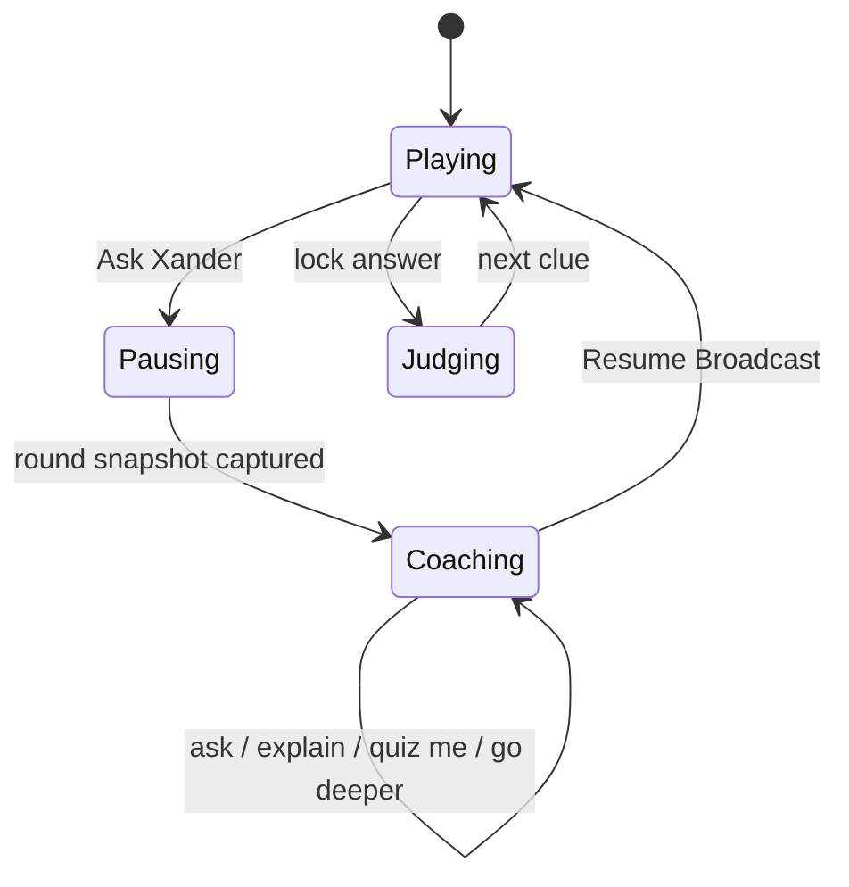
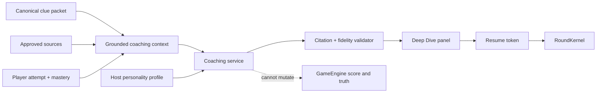

# Deep Dive Dojo: Pausable Coaching Architecture

## Product Promise

At any clue, the player can suspend the broadcast and ask the host to help them understand the underlying topic. The game becomes a conversation without becoming a different website, losing score state, or letting generated dialogue rewrite factual truth.

The emotional transition is deliberate:

- **Game host:** brisk, theatrical, mischievous, and score-aware.
- **Learning coach:** patient, Socratic, adaptive, and still unmistakably the same character.
- **Return to game:** one action restores the exact clue, input, score, streak, and round state.

Working UI label: **Ask Xander**. Working internal name: **Deep Dive Dojo**.

## Implemented Foundation

The first deterministic slice is now live in the cabinet:

- immutable, versioned canonical and grounded clue packets;
- localized presentation kept separate from canonical truth;
- explicit pausing, paused, and resuming phases in the authoritative round kernel;
- single-use round snapshots that preserve input, answer visibility, score references, focus, and UI moment;
- a canonical `StudyController` transaction with score-integrity checks and
  presentation-failure rollback;
- a responsive Ask Xander side panel with five deterministic study moves;
- event-bus narration for study entry, actions, exit, and integrity failures.

For competitive integrity, entering study from an unanswered clue first records it as revealed and moves the round to `advance-ready`. The player can explore and retain their tentative input for reflection, but cannot reveal the canonical answer and then return to a scoreable state. AI follow-ups and reviewed enrichment remain future adapters behind this deterministic boundary.

## Experience Flow



1. The player presses **Ask Xander** while reading a clue or after its answer is revealed.
2. The `RoundKernel` enters a reversible paused phase. Input, timers, and score mutation are locked.
3. A side panel expands from the host instead of navigating away.
4. The panel begins with useful affordances:
   - Explain this simply
   - Why is that the answer?
   - Give me the backstory
   - Connect this to something I know
   - Quiz me one step at a time
5. The player can ask free-form follow-ups.
6. **Resume Broadcast** restores the exact round snapshot.

## The Non-Negotiable Boundary

The host is a performance layer. The host is not the fact authority and never scores an answer.



Every response should distinguish among:

- verified statements grounded in the clue packet or approved retrieval;
- useful analogies or jokes, clearly presented as explanation;
- uncertainty, when the available evidence is insufficient.

## Core Modules

### `StudyController` (implemented)

Owns deterministic entry, grounded action selection, integrity checks, failure
rollback, and exact exit.

```js
enter()
selectAction(actionId)
exit()
```

It receives read-only game state and cannot call scoring methods. A future
conversation controller can request mastery observations such as “player asked
for a simpler explanation,” but the progression system decides whether and how
to store that signal.

### `RoundSnapshot`

A versioned, serializable snapshot containing:

- active clue id and canonical content;
- visible language and current input text;
- round phase and remaining timer duration;
- answer visibility;
- score and streak references, not mutable copies;
- focused control and media-modal state;
- a single-use resume token.

Entering coaching cancels presentation timers. Resuming creates fresh timers from
the remaining duration; old callbacks stay invalidated by the kernel generation
token. Snapshots are tied to the originating round id and cannot resume a newer clue.

### `GroundedCluePacket`

The minimum knowledge bundle sent to the coaching service:

- canonical question and answer;
- accepted-answer policy;
- concise explanation;
- source citations and retrieval date;
- category, era, and relevant entities;
- healthy media metadata, never a broken URL;
- player answer and judgment reason when already submitted;
- locale and desired reading level.

The current archive does not consistently contain explanations and sources. Production coaching therefore depends on the planned curated content schema, not raw clue text alone.

### `CoachGateway`

A server-side or worker endpoint keeps model credentials out of the static client. It accepts the grounded packet, player message, and host profile id; it returns:

- response text;
- citations tied to claims;
- suggested follow-up actions;
- confidence and grounding metadata;
- optional host animation and audio cues.

The gateway should cache by clue id, question intent, locale, host id, and prompt version. Free-form personal questions should be excluded from shared caches.

## Customizable Host Profiles

A host profile is a portable performance and teaching configuration, not an unrestricted system prompt.

```json
{
  "id": "xander-trefleck-v1",
  "displayName": "Xander Trefleck",
  "personaVersion": 1,
  "voice": {
    "cadence": "dry, concise, theatrical",
    "humorIntensity": 0.72,
    "motifs": ["Canadian bureaucracy", "questionable tender"]
  },
  "teaching": {
    "defaultStrategy": "socratic-then-explain",
    "analogyBias": 0.65,
    "challengeLevel": "adaptive",
    "encouragementStyle": "warm-under-the-needle"
  },
  "boundaries": {
    "neverPunchDown": true,
    "neverMockConfusion": true,
    "avoidTopics": []
  },
  "presentation": {
    "skinPack": "channel-o-dope",
    "voiceId": null,
    "coachPose": "patient-master"
  }
}
```

Customization can eventually expose safe sliders, motifs, teaching strategies, visual packs, and voice choices. Raw prompt editing belongs in an advanced creator tool with validation and preview, not the normal player settings.

## Detachable UI Strategy

Ship this in increasing levels of technical risk:

1. **In-cabinet panel:** responsive side sheet on desktop, full-height sheet on mobile. This is the reliable MVP.
2. **Persistent mini coach:** collapsible host portrait and conversation summary while the player inspects sources.
3. **Optional separate window:** synchronize through `BroadcastChannel` with a heartbeat and ownership token. If the window closes, the main game remains paused and recoverable.

Do not make a separate window the only implementation. Popup blockers, mobile browsers, and refresh recovery make it an enhancement rather than the foundation.

## Safety And Privacy

- Send only the active fact packet and necessary recent conversation, not the full player history.
- Do not infer sensitive traits from learning behavior.
- Let players clear conversations and disable cloud coaching.
- Moderate both player input and generated output.
- Render citations as inspectable links with source titles and retrieval dates.
- Refuse fabricated certainty; a grounded “I do not have enough evidence” is a successful response.

## Delivery Sequence

### Slice 1: Pause Contract

- Add `PAUSED` to round phases.
- Capture and restore a tested `RoundSnapshot`.
- Add the in-cabinet panel with static coaching actions.
- Preserve typed input and exact score state across enter/exit.

### Slice 2: Grounded Explanation

- Extend the production clue schema with explanation, sources, entities, and reading-level metadata.
- Build `GroundedCluePacket` validation.
- Render cited, deterministic explanation content without AI.

### Slice 3: Conversational Coach

- Add the secure `CoachGateway`.
- Add free-form questions, streaming responses, cancellation, and retry.
- Validate citations and show uncertainty states.
- Log latency, grounding failures, resume rate, and follow-up depth.

### Slice 4: Companion Creator

- Formalize the host profile schema and migration rules.
- Add safe personality and pedagogy controls.
- Preview a host against fixed test questions before activation.
- Add export/import for profiles without secrets or private conversation data.

## Success Measures

- Players resume the round after exploring instead of abandoning it.
- Deep Dive improves later retrieval of the same concept.
- Responses remain grounded and cited under adversarial testing.
- Entering and leaving coaching never changes score, streak, answer state, or timer unfairly.
- Different host personalities feel distinct while teaching the same verified content.

## Next Lead Domino

Implement **Slice 1: Pause Contract** together with the curated clue packet schema. A conversational UI before snapshot safety and grounded explanations would be impressive-looking debt; these two foundations make the eventual coach trustworthy, detachable, and genuinely useful.
