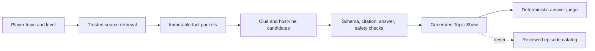

# JeoPARODY Episode and Editorial Playbook

See also [Voice Production and AI Stack](VOICE_PRODUCTION_AND_AI_STACK.md) for
the consent, synthesis, speech-input, and dynamic-dialogue boundary.

**Status:** canonical product direction

**Reviewed:** 2026-08-07

**Scope:** episodes, archive use, learning design, host writing, AI boundaries,
and the visual grammar that joins them.

## Product Truth

JeoPARODY does not have only ten questions.

It has three distinct content layers:

| Layer | Current size | Purpose | Player-facing authority |
| --- | ---: | --- | --- |
| Historical archive | 216,930 records | Research, discovery, edge cases, and source leads | No |
| Normalized runtime bank | 10,000 clues | Local research and migration tests only | Never shipped |
| Authored Season Zero pack | 10 aired clues plus 1 standby | Reviewed, paced, sourced, bilingual show | Yes |

The archive is a quarry. An episode is a building. Counting the stones does not
mean the house has been inspected.

The production artifact does not ship the archive or normalized runtime bank.
If episode transport fails, the app uses a small embedded reviewed emergency
broadcast. This prevents historical television wording from becoming an
accidental public content catalog.

## Two-Lane Catalog

The catalog should grow through two complementary lanes.

### Editorial Episodes

These are reviewed, sourced, localized, paced shows with a signed review receipt.
They can carry official progression, mastery, story artifacts, and paid value.

### Topic Shows

A player requests a subject, level, length, and preferred style. A server-side
generator builds a temporary show from cited fact packets. Topic Shows are
clearly labeled as generated, keep source links attached, and do not become
editorial episodes merely because they rendered successfully.

The first useful Topic Show controls are:

- topic or learning goal;
- age or knowledge level;
- five, ten, or fifteen clues;
- recall, connection, or challenge emphasis;
- English, Brazilian Portuguese, or a reviewed bilingual mix;
- optional media, with text-only generation always available.

Generated sessions may still use deterministic scoring and answer judging. They
must not write directly into the reviewed catalog or silently expand accepted
answers.

## What An Episode Is

An episode is a short directed show, not a random sample. The current target is
eight to twelve minutes before optional Study detours.

1. **Entrance:** two or three inviting clues teach the controls and establish a
   motif without announcing that a motif has been established.
2. **Turn:** difficulty and thematic connections increase. The host reveals a
   little more than intended.
3. **Payoff:** later answers recall earlier facts, complete a pattern, or unlock
   a small story artifact.
4. **Memory return:** missed or uncertain facts reappear after spacing, with a
   different prompt that tests retrieval rather than recognition.
5. **Finale:** the show reports what happened, resolves the episode device, and
   offers a reason to return.

Study mode pauses the episode transactionally. Score, clue position, timer,
host state, and media state are restored when the player returns. The coach can
deepen the current fact; it cannot alter the answer ruling or episode order.

## The Episode Factory

The next content domino is a repeatable editorial pipeline:

### Candidate clustering

Search the archive by subject, answer family, era, difficulty, media needs, and
surprising factual connections. A tool may propose clusters. An editor chooses
the episode premise.

### Fact packets

Every candidate becomes a small immutable packet containing the canonical fact,
direct sources, answer policy, aliases, ambiguity notes, media rights, and
translation notes. Archive wording is never presumed publishable.

Facts may inspire new material, but clue wording must be written from independent
sources rather than paraphrased mechanically from a historical television clue.
Facts and discoveries are generally outside copyright protection while original
expression may be protected; final release policy still requires qualified IP
counsel to review the complete name, art, trade dress, archive provenance, and
content workflow.

### Writers' room

The room chooses the order, act structure, clue mechanism, host beats, callbacks,
standby clue, and finale. Comedy may frame the fact but may not blur what the
player is being asked to retrieve.

### Review receipt

No pack becomes `reviewed` until fact, answer, language, media, rights, and
playability checks each have an owner and date. AI can prepare candidates. It
cannot sign the receipt.

## Council Synthesis

The requested panel is treated as a set of professional review lenses, not as
fictional endorsements from named people.

| Lens | Hard question | Product decision |
| --- | --- | --- |
| Game-show producer | Does the show escalate, or merely continue? | Every episode has acts, reveals, and a timed payoff. |
| Game designer | Is a correct answer the only interesting event? | Confidence, wagers, Study detours, artifacts, and callbacks create additional decisions. |
| Game theorist | Can strategy dominate knowledge unfairly? | Keep scoring transparent; isolate high-variance wagers in declared formats. |
| Trivia editor | Can every accepted answer be defended? | Store explicit aliases and ambiguity notes; preserve a dispute ledger. |
| Learning scientist | Will the player retrieve this tomorrow? | Schedule transformed memory checks and explain corrections immediately. |
| Memory competitor | Does the fact have a retrieval hook? | Attach image, contrast, story, location, or absurd concrete association. |
| Comedy editor | Is the joke doing more work than the sentence? | Fact first, one turn, stop early. Delete commentary that only announces tone. |
| Illustrator | Can a player read the hierarchy before admiring the art? | Dialogue and controls stay quiet; scenes carry the dense visual jokes. |
| Graphic novelist | Who is speaking, and where should the eye move next? | Use consistent panel, tail, caption, and reaction grammar. |
| Sprite animator | What verbs define the host? | Build idle, present, listen, judge, recover, celebrate, and conceal before adding costumes. |
| Accessibility lead | Does the show survive without motion, sound, color, or perfect vision? | Every cue has a semantic equivalent and a reduced-motion state. |
| AI architect | What happens when the model is absent or wrong? | Deterministic play remains complete; generation is optional, bounded, and cited. |
| Software architect | Which system owns truth? | Episode contract, round kernel, and session manager remain canonical owners. |

## Highest-Leverage Innovations

### 1. Directed daily broadcast

Release one authored episode on a predictable cadence. On return, begin with a
short rematch assembled from the player's due facts, then play the new show.

### 2. Memory callbacks with comic continuity

A missed fact should return as a new clue, a prop in the background, or a host
callback. The callback remains kind. The target is recognition followed by
retrieval, not embarrassment.

### 3. Topic trapdoors

Any clue can open a bounded Study detour with three depths: quick explanation,
connected story, and coach conversation. A visible return control resumes the
episode exactly where it paused.

### 4. Host performance receipts

Every generated line records its beat, approved facts, provider, prompt version,
and whether it was displayed. This makes humor tunable and failures diagnosable
without giving the model control of game state.

### 5. Episode-specific O artifacts

The inserted O can become the collectible emblem of each episode: portal, coin,
eclipse, donut, eye, or a subject-specific object. Geometry remains stable so
the joke survives from favicon to cabinet marquee.

### 6. Background evidence

Dense beach scenes may contain optional visual callbacks and hidden story clues.
They never contain information required to answer the active clue. This gives
the illustration team room for discovery without damaging readability.

### 7. Creator room after the internal factory works

Teachers and writers eventually assemble episodes from reviewed packets, but
the public creator interface should follow the internal pipeline, not precede
it. First prove that the team can make three excellent packs consistently.

### 8. User-directed Topic Shows

The generator should ask one smart follow-up when a topic is broad, retrieve or
accept trustworthy sources, build immutable fact packets, then produce a
temporary episode. The model writes candidates; validators enforce schema,
source presence, answer consistency, duplicate avoidance, safety, and reading
level before the show begins.

## AI Topic-Show Boundary

- Provider credentials live behind a server gateway, never in browser code.
- The model receives approved fact packets, not the raw historical clue archive.
- Every generated clue retains source URLs and generation metadata.
- A failed citation, contradictory answer, or malformed clue removes that clue
  before play and requests a replacement.
- Generated copy is cached by fact-packet hash and prompt version so cost and
  behavior can be audited.
- The feature fails closed to authored episodes when the provider is absent.

## Original House Voice

The requested references point toward useful qualities: dry anti-climax,
Canadian restraint, supernatural or bureaucratic absurdity, and clean comic
specificity. JeoPARODY should combine those qualities into its own voice rather
than impersonating any writer or performer.

### The rule

**State the useful thing. Tilt it once. Leave.**

Good:

> Correct. Disturbingly correct.

Good:

> Xander says the unauthorized O has always been there. Records disagree.

Weak:

> Embark on a delightfully zany journey through a living universe of knowledge.

The weak version uses adjectives to report an intended feeling. The good
versions create a specific situation and let the player find the feeling.

### Writing constraints

- Prefer concrete nouns: envelope, receipt, extension cord, municipal permit.
- Use one joke per UI message. Two only when the second invalidates the first.
- Keep status text operational. Put optional performance in host dialogue.
- Do not make the player the target of humiliation.
- Avoid product fog: journey, seamless, immersive, unlock, elevate, experience,
  and universe are banned unless literally accurate.
- Avoid generic radio language repeated for atmosphere. A signal should be an
  actual signal or a deliberate Channel O motif.
- Do not ask an AI to “make this funny.” Supply beat, fact packet, speaker goal,
  forbidden claims, length, and examples of the house mechanics.
- Read every line aloud. If the setup requires a second breath, cut it.

## Visual Grammar

The cohesive target is an inked graphic novel staged inside a precise arcade
cabinet, with pixel detail used as punctuation rather than wallpaper.

- **Large illustration:** dense environments, halftone texture, hidden jokes,
  cinematic depth, and clear day/night palettes.
- **Dialogue:** clean reading field, confident border, one attribution tail, and
  no decorative detail behind clue text.
- **Pixel layer:** counters, labels, tiny status lamps, transitions, and rewards.
- **Host:** illustrated at higher fidelity than UI sprites; animation follows a
  small readable verb set.
- **Logo:** stable custom letters with the O visibly inserted between R and D.
  The O may change costume; the surrounding word must never collapse around it.
- **Motion:** panel entrances and mechanical button travel clarify state. Motion
  that does not explain a state change is optional and reduced-motion aware.

## Next Three Content Deliverables

1. Finish reviewed `pt-BR` presentation fields for Episode 001 so canonical play
   is fully offline in both languages.
2. Author Episode 002 around a different knowledge arc and one audio clue, with
   one text-only standby that preserves the finale device.
3. Author Episode 003 around memory callbacks from Episodes 001 and 002, proving
   that the learning ledger can shape a show without making it feel remedial.

Three coherent episodes are the minimum useful proof that JeoPARODY has a show
factory rather than one excellent accident.
