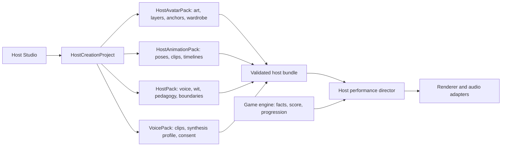

# Host Studio Architecture

**Status:** Canonical blueprint

**Updated:** 2026-08-07

Host Studio is the future creator workspace for designing a host's appearance,
wardrobe, performance, voice, personality, and teaching style. It must extend
the live host system without making gameplay depend on an AI service.

The runtime boundary is already in place. `HostAvatarPack` owns visual identity
and assets. `HostPack` owns personality and performance direction. The game
engine owns facts, scoring, and progression. A model may propose material for a
pack, but only validated, exported pack data can enter a show.

## Current Foundation

Xander's first production avatar pack proves the contract:

- 12 transparent, show-ready wardrobe looks on one `720 x 900` canvas;
- all 12 approved board-short patterns available in the runtime selector;
- 6 preserved special-occasion looks in the approved inventory;
- 8 approved performance poses in the production inventory;
- a versioned `HostAnimationPack` that maps those poses to deterministic CSS or
  future sprite clips, semantic timelines, and reduced-motion behavior;
- a versioned bilingual `VoicePack` with style, fallback, provenance, rights,
  and consent metadata while browser speech remains the executable fallback;
- versioned style, anchor, asset, provenance, and rights metadata;
- deterministic per-show selection that avoids the previous show look;
- player-controlled cycling, local persistence, and a known-good fallback;
- semantic lens and motion effects that do not require new generated frames.

`src/host/host-avatar.js` is the canonical runtime contract. It is intentionally
plain JavaScript so a future editor can export the same structure without
coupling the game to an editor framework.

## Ownership Model



The four pack types can evolve independently:

| Pack | Owns | Must not own |
| --- | --- | --- |
| `HostAvatarPack` | identity art, looks, layers, expressions, anchors, effects | jokes, scoring, correct answers |
| `HostAnimationPack` | semantic poses, clips, renderer descriptors, timelines, reduced-motion output | DOM state, audio, scoring |
| `HostPack` | dialogue style, teaching style, line banks, comedy boundaries | image files, scoring authority |
| `VoicePack` | approved clips, synthesis settings, actor consent, pronunciation | clue facts, progression |

The editor project may contain drafts and provider settings. The exported game
bundle must not contain API keys, raw actor recordings, hidden prompts, or
unapproved generations.

## Creation Workflow

1. **Identity lock:** approve a neutral face, silhouette, age, proportions,
   palette, and core accessories at actual runtime size.
2. **Wardrobe composer:** select or generate shirts, shorts, eyewear, props, and
   effects from typed slots. Every item receives an ID and rights record.
3. **Pose lab:** author the eight semantic poses and verify facial consistency.
4. **Layer editor:** refine masks, edge pixels, anchor points, lens placement,
   mouth placement, and stage baseline.
5. **Motion lab:** map game events to reusable motion primitives before adding
   expensive frame animation.
6. **Personality workshop:** define wit, pacing, learning method, forbidden
   behavior, bilingual guidance, and fallback line banks.
7. **Voice booth:** record or design a voice only with explicit actor consent;
   test English and Brazilian Portuguese separately.
8. **Preview matrix:** test every theme, scene, dialogue skin, breakpoint, and
   high-value game state.
9. **Export gate:** validate schemas, paths, dimensions, alpha, contrast,
   provenance, rights, and fallback behavior.

## Provider-Neutral Generation

Host Studio should call capabilities, never model names directly:

```js
imageProvider.generateCharacter(request)
imageProvider.editWardrobe(request)
maskProvider.extractLayers(request)
motionProvider.createPoseDraft(request)
voiceProvider.designVoice(request)
voiceProvider.cloneConsentedVoice(request)
```

Each adapter returns a job record with provider ID, model/checkpoint, seed,
workflow version, prompt version, source hashes, output hashes, license notes,
and completion status. Failed or unavailable providers leave the draft intact.

Generation belongs in the creator workspace, not application startup. The
shipped game must boot, render, and play with every provider disabled.

## Local-First Toolchain

These are candidates, not hard dependencies. Recheck model and checkpoint
licenses before commercial use.

| Capability | Current candidate | Architectural use |
| --- | --- | --- |
| Character generation and precise edits | [Qwen-Image](https://github.com/QwenLM/Qwen-Image) | Apache-2.0 generation/edit adapter for identity studies, wardrobe drafts, and scene work |
| Visual workflow execution | [ComfyUI](https://github.com/Comfy-Org/ComfyUI) | External local workflow service with reusable JSON graphs and API jobs; keep its GPL code outside the browser bundle |
| Hands-on paint and mask correction | [Krita AI Diffusion](https://github.com/Acly/krita-ai-diffusion) | Artist-facing external editor for inpaint, regions, pose, depth, and layer workflows |
| Image and video cutouts | [SAM 2](https://github.com/facebookresearch/sam2) | Apache-2.0 mask provider for extracting clean editable layers |
| Experimental portrait motion | [LivePortrait](https://github.com/KlingAIResearch/LivePortrait) | Offline prototype adapter for motion studies; exported results still require pixel cleanup and identity review |
| Voice design and consented cloning | [Qwen3-TTS](https://github.com/QwenLM/Qwen3-TTS) | Apache-2.0 voice adapter with English, Portuguese, style control, streaming, and short-reference cloning |

ComfyUI can remain the common local job runner while Host Studio owns the
stable request and result schemas. That lets the project replace a workflow or
model without changing saved hosts or the game runtime.

## Editor Surfaces

The first useful Host Studio does not need to imitate Photoshop. It needs five
focused rooms:

1. **Identity:** reference board, locked invariants, side-by-side candidate
   voting, and anti-drift overlays.
2. **Closet:** slot-based wardrobe grid, colorways, rarity, episode rules, and
   shuffle weights.
3. **Performance:** pose timeline, semantic event mapping, lens/mouth anchors,
   and reduced-motion behavior.
4. **Personality:** editable HostPack fields, sample lines, repetition checks,
   teaching previews, and prohibited claims.
5. **Voice:** recording consent, sample quality, pronunciation, emotional range,
   synthesis comparison, and accessible transcript review.

Every generated result enters as a candidate. Nothing becomes canonical until
the creator explicitly approves it.

## Safety, Rights, and Privacy

- Voice cloning requires a signed release and an affirmative consent record.
- Raw recordings stay local or in explicitly chosen private storage.
- The studio must reject attempts to imitate an unconsenting real person.
- Every asset retains generation and editing provenance through export.
- Pack import is data-only: project-local asset paths, bounded text, known
  schema versions, and no executable code.
- Commercial export blocks unknown or incompatible licenses.
- Generated dialogue never changes clue truth, accepted answers, score, or
  episode progression.

## Delivery Sequence

### Phase 1: Runtime contract, complete

- canonical `HostAvatarPack`;
- canonical `HostAnimationPack` with eight semantic poses and CSS realization;
- canonical `VoicePack` foundation with browser-safe bilingual fallback;
- 12-look Xander wardrobe;
- anchors, fallback, persistence, semantic motion, and tests.

### Phase 2: Read-only Closet

- in-app gallery for avatar looks and inventory;
- preview against all scenes and themes;
- import/export a validated pack JSON file;
- no generation yet.

### Phase 3: Local Creator

- editable wardrobe metadata and shuffle weights;
- crop, scale, mask, anchor, and palette tools;
- non-destructive draft history;
- Qwen-Image/ComfyUI and SAM 2 adapters as optional local services.

### Phase 4: Personality and Voice

- HostPack editor and scenario simulator;
- consent ledger and recording booth;
- Qwen3-TTS adapter behind a local service;
- pre-rendered clip export before live synthesis.

### Phase 5: Motion Workshop

- pose graph and mouth/lens timelines;
- sprite sheet and layered WebP export;
- optional LivePortrait research adapter;
- strict runtime budget and reduced-motion output.

## Acceptance Gates

A custom host is shippable only when:

- every referenced asset exists and has approved dimensions and transparency;
- the identity remains recognizable across all required poses;
- the host is readable at the smallest phone breakpoint;
- all themes and dialogue skins meet contrast requirements;
- missing optional assets fall back without blocking gameplay;
- voice consent and asset rights are complete;
- no provider secret appears in the exported bundle;
- the game passes with all AI providers offline.
