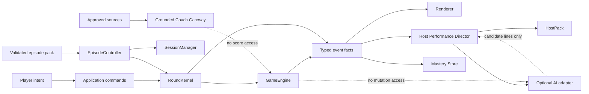

# JeoPARODY Optimal Prime Roadmap

**Decision date:** 2026-07-26
**Status reviewed:** 2026-07-27
**Working branch:** `convergence/jeoparody-v3`
**Executable base:** Jeopardish `b9dc873`
**Architecture donor:** JeoPARODY `e71d0dc`

## Executive Decision

Do not start over again. Do not merge either repository wholesale into the other.

Build the product named **JeoPARODY** on the current, tested Jeopardish runtime while
selectively porting ideas and assets from the later JeoPARODY repository through
explicit contracts. The repository name is transport history; it does not decide
the product identity or architecture.

This decision follows measured behavior:

| Evidence | Current Jeopardish base | JeoPARODY donor |
| --- | --- | --- |
| Automated tests at audit | 107 passing | 40 passing |
| Live critical path | Playable classic episode | Classic start remained on splash |
| Runtime source reachability | Explicit script manifest | 23 of 62 source JS files reachable |
| Production questions | Validated 10,000-clue runtime bank | Question requests returned 404 |
| Production package | Complete, audited static build | Incomplete asset output |
| Styling | Owned cascade layers, zero duplicate selectors | Multiple competing systems |
| Media | Preflight, substitution, modal fallback | Useful handlers exist but are off the live path |
| Study mode | Grounded pause/resume foundation | No equivalent reliable live flow |

The donor repo has valuable product concepts, names, experiments, and some useful
algorithms. It is not a sound executable base. The current runtime has stronger
behavior but still needs cleaner orchestration and a more explicit product model.
Optimal Prime is the convergence of those truths.

## Current Status

The convergence runtime now has a real authored Season Zero path, not merely a
roadmap for one:

- 189 automated tests pass.
- The CSS audit reports 4,747 lines, 677 selector rules, five `!important`
  declarations, and zero duplicate selectors.
- The question validator covers 216,930 archive clues, the 10,000-clue runtime
  bank, and an eleven-clue reviewed episode pack.
- The authored episode presents ten clues in a deliberate three-act order, with
  accepted aliases, reviewed explanations and sources, confidence and dispute
  capture, review queues, one local media clue with a standby, and an earned
  finale artifact.
- The static production artifact is 34.9 MB, below its 38 MB total-build budget,
  with no archive leakage or broken local references found by the dist audit.
- `RoundKernel`, `CluePipeline`, `EpisodeController`, `StudyController`,
  `InputController`, `PreferenceStore`, and `ApplicationComposition` now own the
  critical workflows that previously competed inside `app.js`.
- `ProductTelemetry` converts eight approved event facts into versioned,
  content-free product events and uses a no-op sink by default; player answers,
  clue text, reinforcement responses, transcripts, URLs, titles, and error
  messages never enter its payloads.
- `LearningLedger` persists local-only Study and retrieval evidence without
  coupling mastery to score, streak, round phase, or the episode session.

The convergence baseline is now verified:

- `npm run verify` passes 189 unit and contract tests, content validation, CSS
  and asset audits, the static build, and the production artifact audit;
- production smoke passes in Chromium and WebKit for the landing page, standalone
  game, and Creative Room;
- the full Season Zero production proof passes in Chromium and WebKit across
  exact, alias, fuzzy, incorrect, reveal, confidence, dispute, translated-answer,
  refresh-resume, sourced Study, bilingual memory reinforcement, completion
  review queue, media viewer, finale, replay, voice fallback, and forced
  media-standby paths;
- cold first-party transfer is 6.01 MB or less in Chromium and 5.34 MB or less
  for the standalone game in either engine;
- the smoke exercises theme switching, menu focus behavior, an authored correct
  answer with score change, and the protected Study pause/resume path.
- the responsive visual gate captures 180 deterministic combinations across six
  viewport families, two themes, and fifteen gameplay states, including
  confidence, translation, media, Study, reinforcement, voice, and finale;
- the established production accessibility baseline passes in Chromium and
  WebKit across landing, Creative Room, and eight critical game states at
  desktop and phone widths. Reinforcement is now part of the audit matrix; its
  expanded cross-engine rerun remains a release check.

It is a trustworthy checkpoint, not yet a release candidate:

- `app.js` remains 964 lines and `Renderer` remains 1,344 lines;
- 200% zoom and real-device screen-reader passes remain manual release checks;
- the Season Zero learning ledger and completion review queue exist, but there
  is no due-date scheduler, daily entry flow, or cross-episode curriculum yet;
- host performance remains mostly provisional and public release still requires
  an original identity, rights review, and production-ready assets.

## Product Thesis

JeoPARODY is a comedy learning show that happens to be playable:

1. A player enters a tightly directed 7-12 minute episode.
2. Canonical clue truth and scoring remain deterministic.
3. A host performance system turns facts into an authored show.
4. The player can pause the broadcast and explore a topic without corrupting the round.
5. Missed or uncertain knowledge returns later through a local-first review loop.
6. AI may perform, explain, remix, and help create assets; it may never silently
   replace factual truth, score an answer, or invent a source.

The MVP is not “all of Jeopardy plus every nostalgic game show.” The MVP is one
excellent episode loop that proves humor, learning, and replay value. New formats
become episode rules and scene packs after that loop earns completion and return.

## Non-Negotiable Contracts

### One Owner Per Truth

| Concern | Sole owner |
| --- | --- |
| Answer normalization and comparison | `game-logic.js` |
| Active clue, score, streak, answer outcome | `GameEngine` |
| Legal round phase and presentation transaction | `RoundKernel` |
| Episode source, current clue, completion, restart | `EpisodeController` |
| Episode order, outcome history, review queues, resume | `SessionManager` |
| Local Study and retrieval mastery | `LearningLedger` |
| Canonical clue content | `EpisodeContract` validated pack |
| DOM presentation | Renderer and component owners |
| Host expression and skin | Host performance layer |
| Generated dialogue | Optional performance adapter |
| Learning conversation | Grounded coach gateway |
| Product measurement | `ProductTelemetry` with an approved injectable sink |

No renderer may infer game state from CSS. No host or AI module may mutate score.
No stale async task may apply work to a newer round. No translation may replace
canonical English truth.

### AI Is A Bounded Collaborator

Runtime generation receives a versioned fact packet and emits a versioned
performance candidate. It never receives write access to the game engine.

Every generated artifact or line needs a receipt:

```json
{
  "schema": "jeoparody.generation-receipt",
  "version": 1,
  "kind": "host-line",
  "provider": "local-or-remote-adapter",
  "model": "provider-model-id",
  "promptVersion": "host-performance-v1",
  "sourceIds": ["clue-42"],
  "createdAt": "ISO-8601",
  "reviewState": "unreviewed",
  "rights": "project-original"
}
```

Generated output is cacheable, cancellable, inspectable, and disposable. Canonical
content is reviewed, sourced, versioned, and durable.

## Target Runtime



### Runtime Layers

1. **Truth:** clue schema, answer policy, scoring, episode rules.
2. **Workflow:** legal transitions, cancellation, pause snapshots, commands.
3. **Presentation:** renderer view models, motion, sound, accessibility.
4. **Performance:** host beats, dialogue candidates, voice, comedy callbacks.
5. **Learning:** explanations, sources, mastery, reviews, grounded coaching.
6. **Adapters:** storage, translation, optional AI, telemetry, deployment.

Dependencies point inward. Optional services fail open without freezing the game.

## Execution Order

### Gate 0: Preserve And Measure

**Status: complete**

- Audit every Jeopardish remote branch and prohibit wholesale merges.
- Audit the JeoPARODY import graph, build, tests, and live startup.
- Create `convergence/jeoparody-v3` from the working executable base.
- Keep a donor ledger with provenance and an explicit disposition.
- Preserve both source histories until preview deployment is verified.

This gate prevents an architectural opinion from erasing working behavior.

### Gate 1: Authoritative Round Kernel

**Status: complete**

- Replace competing engine/director phase ownership with `RoundKernel`.
- Define legal transitions and publish immutable transition facts.
- Give every clue transaction a round id.
- Cancel timers and ignore stale asynchronous work.
- Tie pause snapshots to the originating round.
- Prevent judgment callbacks while paused or outside `answering`.
- Keep `GameEngine` focused on clue truth and scoring.

**Exit evidence:** unit tests cover legal flow, cancellation, illegal transitions,
duplicate judgment, presentation failure, reveal, pause/resume, stale snapshots,
and score-callback lockout.

### Gate 2: Shrink The Composition Root

**Status: workflow ownership landed; coordinator and renderer extraction remain**

**Goal:** turn `app.js` from a 1,175-line behavior owner into a readable bootstrap.

Completed first because it carried the highest stale-work risk:

- `CluePipeline`: one cancellable transaction owns session candidate selection,
  media preflight, translation, and render commit.
- `PreferenceStore`: one validated owner persists theme, language, host,
  dialogue, scene, sound, and voice preferences without blocking startup.
- `StudyController`: one transaction owns grounded packet creation, score
  integrity monitoring, study actions, failure rollback, and exact round resume.
- `InputController`: one command vocabulary now routes renderer callbacks,
  keyboard shortcuts, and parsed voice intents through the same handlers, with
  source-aware and payload-safe diagnostics.
- `ApplicationComposition`: one two-phase root now constructs the service graph,
  binds browser lifecycles, reports startup/shutdown, rolls back failed startup,
  and cancels owned work exactly once.
- `EpisodeContract`: one immutable, versioned content boundary validates authored
  packs and labels historical-bank compatibility data instead of silently
  treating archive rows as production content.
- `EpisodeController`: one owner now handles source loading, adaptation, resume,
  current clue identity, outcome locking, progress, completion, restart, and
  broken-media replacement.

Remaining coordinator extraction:

1. Move static interface copy into an i18n catalog now that episode ownership is
   no longer entangled with it.
2. Extract presentation choreography only after the first authored episode
   proves which beats are reusable.

Each extraction must preserve browser behavior and add a contract test. Avoid a
framework migration during this gate; changing module boundaries and module
format simultaneously would make regressions difficult to locate.

**Exit criteria:**

- `app.js` is below 400 lines.
- Startup binds essential controls before optional audio, translation, or AI work.
- No UI preference is persisted from multiple modules.
- A command cannot bypass `RoundKernel`.

### Gate 3: Product-Grade Content Pack

**Status: first reviewed authored vertical slice implemented**

Replace “random row from an archive” with a small authored episode.

```json
{
  "id": "season-zero-001",
  "title": "A Respectable Amount of Trouble",
  "schemaVersion": 1,
  "clues": [{
    "id": "sz-001-01",
    "category": "History",
    "value": 400,
    "clue": "Canonical clue text",
    "answer": "Canonical answer",
    "acceptedAnswers": [],
    "explanation": "Reviewed explanation",
    "sources": [],
    "media": [],
    "difficulty": 0.4,
    "tags": [],
    "performance": {}
  }]
}
```

- Validate schema, uniqueness, values, media, source URLs, and accepted answers.
- Curate a Season Zero arc with escalation, callback opportunities, and a finale.
- Record attempt outcomes as separate `isCorrect`, `creditEligible`, `reason`,
  and `scoreDelta` facts. A post-reveal response may be educationally correct
  while remaining ineligible for score or competitive streak.
- Add answer dispute and confidence capture: knew it, shaky, learned it.
- Keep the 216,930-clue archive as research input, not the public product payload.
- Record provenance and licensing before commercial deployment.

Implemented foundation:

- schema version 1 and immutable normalization;
- validation for identity, values, accepted answers, sources, media, difficulty,
  and production review requirements;
- stable clue identities for adapted historical rows;
- explicit `legacy-adapter` kind and `archive` review status;
- separate correctness and credit facts;
- reviewed ten-clue Season Zero pack in authored order across three acts;
- one resilient local-media clue and archive transport fallback;
- explicit accepted aliases reaching the deterministic judge;
- sourced explanations, backstory, and connections in Study mode;
- confidence and dispute annotations with missed/revealed/shaky review queues;
- finale artifact revealing the clue-order signal `BROADCAST O`;
- migration of existing version 1 local sessions.

**Exit criteria:** every production clue is explainable, sourceable, media-safe,
and testable; an episode has a beginning, escalation, payoff, and result.

### Gate 4: Host Performance System

Formalize a portable `HostPack`:

- identity, vocabulary, motifs, boundaries, teaching style;
- skin set and expression map;
- voice configuration and rights metadata;
- authored line banks by event and emotional beat;
- optional generation policy and fallback order.

Add a `HostPerformanceDirector` that consumes event facts and emits presentation
commands. Start with authored deterministic lines. Add provider adapters only
after fallback behavior, cancellation, caching, and content review exist.

Animation should use semantic primitives such as `enter`, `react`, `hold`,
`recover`, and `exit`. Do not build a general animation framework before three
real host sequences prove which composition features are needed.

**Exit criteria:** the same round can run with AI disabled; three host packs feel
distinct without changing facts; voice and animation can fail independently.

### Gate 5: Deep Dive Dojo

- Extend clue packets with reviewed explanation, entities, sources, and locale.
- Keep deterministic study actions useful without AI.
- Add a server or worker `CoachGateway`; never expose shared provider keys.
- Stream cancellable responses with source-linked claims and uncertainty states.
- Preserve a single-use resume token and round integrity.
- Add the detachable window only as a progressive enhancement using
  `BroadcastChannel`; the in-cabinet panel remains canonical.

**Exit criteria:** coaching never changes score or answer eligibility; players can
inspect sources and resume; unsupported claims are withheld rather than improvised.

### Gate 6: Learning Memory And Episode Payoff

- Add a versioned local `PlayerProfile`.
- Store outcome, comparison reason, confidence, topic tags, and review due date.
- Maintain distinct missed and revealed review queues; revealing an answer is
  useful learning evidence, not the same event as answering incorrectly.
- Begin with a transparent Leitner-style queue.
- Add a 30-second finale: score, accuracy, facts learned, future reviews, host
  callback, and spoiler-safe result card.
- Add daily review and return flow before accounts or cloud sync.

**Exit criteria:** a returning player receives a meaningful review based on their
actual attempts, and every episode ends with an emotional and educational receipt.

### Gate 7: Additional Formats

Introduce the JeoPARODY amalgam through the same kernel:

- full board;
- run the category;
- daily double and wager;
- final round;
- rapid fire;
- audio and visual rounds;
- later, legally distinct mechanics inspired by nostalgic shows.

Each format supplies episode rules and presentation beats. It does not create
another engine, store, renderer, or answer validator.

The PAO trainer remains a hidden, isolated easter egg until its product role is
clear. Its unlock can stay theatrical; its code must not join the trivia state.

### Gate 8: Ship And Learn

- Browser E2E: first clue, exact/fuzzy/incorrect/reveal, broken media, translation,
  study/resume, episode completion, refresh recovery, keyboard, voice fallback.
- Visual matrix: narrow phone, phone landscape, tablet, laptop, large desktop;
  day/night; all clue states; reduced motion.
- Accessibility: keyboard, focus, live announcements, zoom, contrast, captions.
- Preview-server accessibility checks block critical and serious violations.
- Separate budgets for first-route transfer, each content pack, and the complete
  static artifact. A small total build must not excuse an expensive first paint.
- CSP, secret isolation, dependency audit, asset licensing, privacy-safe telemetry.
- Preview deployment, observed playtest, top-failure correction, then promotion.

## What We Deliberately Reject

- A third greenfield rewrite.
- Wholesale adoption of JeoPARODY's dead component/store tree.
- A large dependency-injection container before construction is genuinely hard.
- Storybook, A/B infrastructure, or a universal animation composer before the
  core episode and three representative components demand them.
- AI-generated canonical facts or direct client-side shared API keys.
- Realtime multiplayer, public leaderboards, mandatory accounts, or virtual
  currency before completion and return are measurable.
- Public deployment of likenesses, voices, music, clues, or logos without a
  documented rights decision.

## Quality Gates

| Gate | Required evidence |
| --- | --- |
| Behavior | Unit suite and browser critical path pass |
| State | One phase owner; one scoring owner; stale work cannot commit |
| Content | Schema, provenance, answer policy, media, and source validation |
| Visual | Fixture matrix reviewed at supported sizes and themes |
| Accessibility | Keyboard flow, focus restoration, live regions, reduced motion |
| Performance | Route and episode payload budgets; no idle frame loop |
| AI | Deterministic fallback, cancellation, receipt, no truth mutation |
| Release | Complete static artifact, preview smoke, rollback point |

## Product Measures

Measure only what answers a product question:

1. **Activation:** did the player attempt the first clue?
2. **Completion:** did they finish an episode?
3. **Learning:** did they later retrieve a previously missed concept?
4. **Exploration:** did study mode help them resume rather than abandon?
5. **Return:** did they play or review within seven days?
6. **Trust:** how often was a ruling disputed or a generated claim rejected?

Do not optimize monetization before these are observable. The first sensible
commercial test is a free daily broadcast with paid authored season/host packs,
not charging for basic judgment.

## Revised Lead Dominos

### Domino 0: Trustworthy Baseline

**Status: complete**

**Why first:** every later diagnosis becomes slower if architecture, content,
tests, and release-harness changes remain one anonymous working-tree layer.

1. [x] Repair and regression-test the production smoke contract.
2. [x] Keep fast non-browser verification in `npm run verify`; use
   `npm run verify:release` for the production build plus real browser smoke.
3. [x] Review the complete diff as architecture, episode-content, and release
   evidence groups.
4. [x] Create a named checkpoint and push the convergence branch only after both
   verification tiers pass.

**Exit:** a reproducible remote checkpoint with a green release command and a
small, explicit residual-risk note.

### Domino 1: Vertical-Slice Proof

**Status: complete**

**Why second:** implementation confidence is not player evidence.

1. [x] Expand browser paths to exact, alias, fuzzy, wrong, reveal, dispute,
   confidence, media success and substitution, translation, refresh-resume,
   study, finale, replay, keyboard, and voice fallback.
2. [x] Review deterministic fixtures at narrow phone, phone landscape, tablet,
   laptop, and large desktop sizes in both themes and reduced motion.
3. [x] Add automated keyboard/focus flow and production accessibility checks
   that block critical and serious ARIA, contrast, target-size, and structure
   violations. Keep 200% zoom and screen-reader passes on the manual release list.
4. [x] Define privacy-safe product events for activation, completion, dispute,
   study, replay, and failure; use a no-op adapter until collection is approved.

**Exit:** one evidence bundle proves the authored episode across supported
states, viewports, themes, and release routes.

Run the behavioral proof against a freshly built production artifact:

```bash
PROOF_BROWSERS=chromium,webkit npm run test:episode
```

### Domino 2: Learning Return Loop

**Status: complete for the Season Zero vertical slice**

**Why third:** the existing confidence and review data makes this a relatively
small step with direct learning and retention value.

1. [x] Add a versioned local `LearningLedger` containing stable IDs and aggregate
   learning evidence, never player responses or clue content.
2. [x] Require reviewed bilingual memory prompts and reuse the deterministic,
   typo-tolerant answer judge for retrieval.
3. [x] Add a completion review path that clears reinforced items, persists
   locally, and cannot mutate score, streak, outcome, or round position.
4. [x] Prove the full Study, reinforcement, completion queue, and replay loop in
   Chromium and WebKit, with deterministic visual and accessibility fixtures.

**Exit:** reopening the product preserves which reviewed facts still require
retrieval, and the completed episode supplies an immediate educational next
action. Due-date scheduling, daily entry, cross-episode history, and artifact
ownership remain a later expansion of Gate 6 rather than hidden scope in this
vertical slice.

### Domino 3: Host Intelligence Boundary And Presentation Ownership

**Status: next**

**Why next:** Season Zero and its learning loop now supply enough real clue,
result, Study, reinforcement, and finale beats to design the abstraction from
evidence.

1. Define `HostPack` identity, line-bank, expression, voice, boundary, and rights
   contracts.
2. Add a deterministic `HostPerformanceDirector` consuming event facts.
3. Move static copy into a locale catalog and extract presentation choreography
   from `app.js`.
4. Split `Renderer` by clue, outcome, study, and finale views where the proven
   flows show stable ownership.

**Exit:** three deterministic host packs can perform the same episode; `app.js`
is below 400 lines; AI, voice, and animation can each fail independently.

### Domino 4: Original Identity And Preview Release

Replace temporary likeness-dependent host and brand assets, record rights and
provenance, finish CSP and privacy review, deploy a preview, observe real
playtests, and fix the highest-frequency failures before public promotion.

### Domino 5: Grounded Coach Gateway

Add optional cancellable AI explanations only after deterministic Study mode,
source packets, review memory, and host boundaries are proven. Generated claims
require source links and receipts; provider failure must leave the game usable.

### Domino 6: Wager And Additional Formats

Add the first risk beat, then full-board or other formats through episode rules
and presentation beats. No format earns a second engine, judge, store, or
renderer.

## Immediate Next Domino

Execute **Domino 3: Host Intelligence Boundary And Presentation Ownership**.
Define the deterministic host-performance packet and director first, then move
static performance copy and choreography behind that boundary before adding any
runtime model. The first proof is three distinct, original host packs performing
the same Season Zero facts and learning beats while scoring, sources, and review
mastery remain unchanged. Do not spend the next pass on another broad CSS
overhaul, wager mechanics, accounts, or fresh branch mining.
