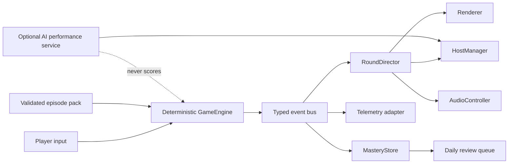

# JeoPARODY Production Plan: Season Zero

**Date:** 2026-07-12  
**Decision:** Build one complete ten-minute episode before expanding the platform.  
**North star:** A player laughs, learns a fact they can recall tomorrow, uncovers one piece of the Malex mystery, and immediately wants another broadcast.

> **Status note, 2026-07-27:** This document preserves the original Season Zero
> product rationale. The authoritative execution order now lives in
> `OPTIMAL_PRIME_ROADMAP_2026-07-26.md`. The authored episode, deterministic round
> kernel, sourced study material, confidence/dispute capture, review queues, and
> finale artifact described here are implemented. The active bottleneck is a
> verified checkpoint and complete episode proof matrix, followed by the
> player-level return loop.

> This council uses the design lenses associated with elite engine, game, product, learning, accessibility, and entertainment teams. It is a product exercise, not an endorsement by the named people or companies.

## Executive Verdict

Jeopardish has crossed the line from rough experiment to an authored vertical
slice. The responsive cabinet, deterministic answer judge, round kernel, media
handling, scene system, console narration, sourced study flow, and Season Zero
episode are real foundations.

The bottleneck is now **proof and return**. The app has a directed ten-clue
episode, explicit round timing, persisted outcomes/score/streak, confidence and
dispute capture, reviewed explanations, media-safe substitution, completion
summary, replay, and a story artifact. It still needs complete browser and visual
evidence, a player-level review schedule, production host identity, and the first
wager beat.

The highest-leverage release is **Season Zero**, a single polished vertical slice with:

1. A directed ten-clue episode with authored pacing and original sound.
2. A trusted, small, source-backed content pack with explanations and accepted answers.
3. A lightweight mastery and daily-return loop.
4. One story artifact earned through play.
5. Production-grade loading, accessibility, telemetry, error recovery, and deployment.

This slice should feel small in breadth and finished in depth.

## Council Synthesis

### Systems and Carmack Lens

- Make game state explicit and deterministic.
- Keep animation, audio, host comedy, and AI downstream of authoritative game events.
- Cancel stale timers and media whenever a new clue supersedes an old one.
- Shrink the initial payload from tens of megabytes to a manifest plus an episode pack.
- Instrument the loop before adding modes, accounts, or multiplayer.

### Nintendo Lens

- Teach through the first thirty seconds, not a manual.
- Give every button an immediate audiovisual response.
- Make wrong answers informative and emotionally safe.
- Let the first session reach a satisfying ending in under ten minutes.
- Use progressive disclosure: one mechanic, then one wrinkle, then one finale.

### Sega, Sony, and Rockstar Lens

- Treat transitions, music stings, typography, and host reactions as gameplay.
- Give Season Zero a memorable visual identity rather than a collection of effects.
- Make the mystery environmental: props, interrupted broadcasts, counterfeit notes, and host slip-ups should reward attention without blocking trivia.
- Preserve fast replay. Theater must never become a loading screen wearing a funny hat.

### Learning-Science Lens

- Ask for retrieval before reveal.
- Explain why the answer is correct after judgment.
- Capture confidence and answer quality without slowing every clue.
- Return missed or shaky facts on an expanding schedule.
- Reward consistency more than marathon sessions.

### Product and Growth Lens

- The first sellable promise is not “216,930 old clues.” It is “a hilarious daily show that actually makes you smarter.”
- Prove activation and return behavior before building subscriptions, profiles, or a content marketplace.
- Create a shareable episode result, but do not require an account.
- Monetize additional seasons, curated knowledge packs, and party features only after the free daily ritual is delightful.

### Trust, Accessibility, and Legal Lens

- AI may write performance candidates, but it must never determine truth, accepted answers, or score.
- Every production clue needs provenance, a canonical answer, accepted variants, an explanation, and a dispute path.
- Keyboard, screen-reader, reduced-motion, contrast, captions, and mute support are release requirements.
- The commercial build needs original host identity and artwork, an original visual system, and a counsel-reviewed content/parody strategy. Prototype Trebek imagery remains a temporary development reference.

## The Lead Dominos

### 1. Direct the Round

Create a `RoundDirector` that turns engine events into a cancellable sequence:

`clue intro -> answering -> lock-in -> judging -> reveal -> payoff -> advance ready`

Add an `AudioController` with original synthesized or licensed cues for focus, lock-in, correct, incorrect, streak, reveal, and episode finale. Audio must unlock after a user gesture, expose mute and volume controls, and degrade cleanly when unavailable.

**Done when:** the same clue feels materially better with the screen hidden and only timing/audio available; rapid clicks cannot create stale state; reduced-motion mode preserves clarity.

### 2. Build One Real Episode

Replace random archive sampling in the flagship path with a curated Season Zero pack:

- 10 clues across 3 escalating acts.
- 1 media clue.
- 1 wager or risk decision.
- 1 deliberate callback to an earlier fact.
- 1 finale.
- 1 evidence artifact that advances the Malex mystery.

Each clue uses a production schema:

```json
{
  "id": "s0-a1-001",
  "category": "Suspiciously Useful History",
  "prompt": "...",
  "canonicalAnswer": "...",
  "acceptedAnswers": ["..."],
  "explanation": "...",
  "sources": [{ "label": "...", "url": "..." }],
  "difficulty": 1,
  "tags": ["history"],
  "media": [],
  "performance": { "hostBeat": "...", "storyBeat": null }
}
```

Keep the historical archive as an internal inspiration and QA corpus, not the default paid-product payload.

**Done when:** every answer can be explained and disputed; the episode has a beginning, escalation, and ending; its runtime assets are small enough for a fast first load.

### 3. Make Learning Persist

Add a local-first player profile with versioned storage:

- episode history;
- per-clue outcome and answer-match reason;
- confidence: `knew it`, `shaky`, or `learned it`;
- topic mastery;
- review queue;
- daily broadcast streak;
- earned artifacts and host skins.

Use a simple Leitner-style review schedule before attempting a sophisticated adaptive model. Sync and accounts can arrive after the local model is stable.

**Done when:** a player can close the browser, return tomorrow, and receive a short review that reflects what they actually missed.

### 4. Create the Episode Payoff

End every run with a thirty-second results sequence:

- score and accuracy;
- facts mastered and facts returning later;
- funniest host callback from the run;
- evidence artifact reveal;
- one-tap replay or tomorrow teaser;
- shareable result card containing no answer spoilers.

This is the emotional receipt for the session. It should make ten clues feel like an event rather than a loop that stopped.

**Done when:** a user can describe what happened in their run and has a clear next action.

### 5. Harden the Product Surface

- Generate a small content manifest and sharded packs at build time.
- Cache the app shell and active episode for resilient repeat loads.
- Add end-to-end tests for first load, reveal, correct, fuzzy-correct, incorrect, media, finale, persistence, keyboard, mute, and narrow mobile.
- Add privacy-respecting event telemetry for activation, clue completion, episode completion, dispute, replay, and return.
- Add a global error boundary and recoverable “resume broadcast” state.
- Establish performance, accessibility, content-integrity, and browser gates in CI.
- Deploy a preview channel before promoting a build to the public URL.

**Done when:** a failed media item does not kill a round, progress survives a refresh, and every release has measurable quality gates.

## Target Architecture



Recommended new boundaries:

- `src/directors/round-director.js`: sequencing, cancellation tokens, phase timing.
- `src/audio/audio-controller.js`: audio unlock, cues, mute, volume, cleanup.
- `src/session/session-manager.js`: episode progression and finale.
- `src/progression/mastery-store.js`: versioned local profile and review scheduling.
- `src/content/content-repository.js`: manifests, episode packs, schema validation.
- `src/telemetry/telemetry-adapter.js`: consent-aware product events with a no-op default.
- `scripts/build-content-packs.mjs`: validate and emit production shards.

`GameEngine` remains the sole authority for answer outcome, score, and active clue. The director may delay presentation, but it may not rewrite truth.

## Execution Swoop

### Pass A: Feel and State

1. Add round phases and cancellation-safe `RoundDirector`.
2. Add `AudioController`, mute UI, and original cue set.
3. Lock duplicate submissions and make Enter consistently advance after payoff.
4. Add focused unit tests for timing, cancellation, and no-audio fallback.

### Pass B: Content and Episode

Vertical slice complete: authored ten-clue order, reviewed content, progress UI,
revision-safe resume, outcome accounting, confidence/dispute capture, sourced
study responses, artifact finale, archive fallback, and replay.

1. [x] Define and validate the production clue schema.
2. [x] Curate the ten-clue Season Zero pack.
3. [x] Add explanation, sources, confidence, callback, and finale rendering.
4. [x] Move the full archive out of the first-load path.
5. [ ] Add one explicit wager/risk decision after the base episode is visually QA'd.

### Pass C: Memory and Payoff

1. Add local profile migration and mastery records.
2. Add daily review selection.
3. [x] Add the first episode result and artifact reveal.
4. Add spoiler-safe share card.

### Pass D: Ship Quality

1. [x] Add browser-level critical-path tests and accessibility checks.
2. Add performance budgets and production asset allowlist.
3. Add privacy-safe telemetry and error reporting adapters.
4. Replace prototype likeness assets in the public build with original Malex art.
5. Deploy to preview, run a small playtest, fix the top observed failures, then promote.

## Release Gates

### Experience

- First meaningful clue appears quickly on a normal mobile connection.
- A complete episode takes 7-12 minutes.
- No interaction creates an unexplained dead state.
- Correct, incorrect, reveal, wager, streak, and finale each sound and feel distinct.

### Learning

- Every production clue has sources, explanation, accepted-answer policy, and review metadata.
- Fuzzy judgments are logged with their reason.
- Players can dispute a ruling without losing their session.
- Missed clues can return in a later review.

### Quality

- Unit, content-validation, and end-to-end suites pass in CI.
- No horizontal overflow at supported phone, tablet, and desktop breakpoints.
- Core loop is fully keyboard operable and screen-reader understandable.
- Reduced motion and mute preserve all essential information.
- A refresh during an episode resumes safely.

### Product

Initial metrics should answer four questions:

1. **Activation:** Did the player answer the first clue?
2. **Completion:** Did they finish the episode?
3. **Learning:** Did they correctly retrieve a previously missed fact?
4. **Return:** Did they play or review again within seven days?

Do not optimize monetization until these are observable. The first pricing test should compare a free daily broadcast against paid season packs or membership, not charge for basic answer checking.

## Explicitly Not Yet

- Realtime multiplayer.
- Public leaderboards.
- Mandatory accounts.
- Open-ended AI-generated facts.
- A giant mode selector.
- User-generated clue publishing.
- Complex economy or virtual currency purchases.
- Native mobile wrappers.
- Full archive search in the player-facing build.

These can become excellent features after Season Zero proves that the core show earns completion and return.

## First Implementation Ticket

**Production Slice 001: Directed Round**

Implement the round and audio directors against the current single-clue game without changing answer correctness. Add explicit phases, stale-timer cancellation, input locking, cue timing, mute persistence, reduced-motion behavior, and tests. Then use that stable sequence as the spine for the ten-clue episode.

This is the first domino because every later feature needs a reliable place in the show to happen.
