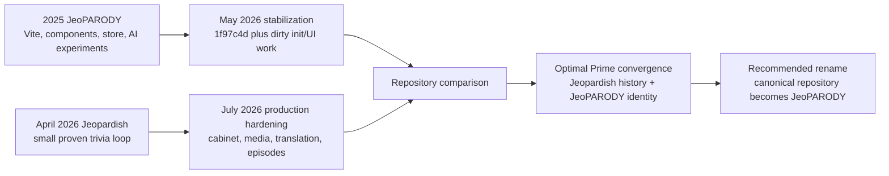
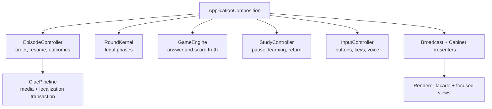
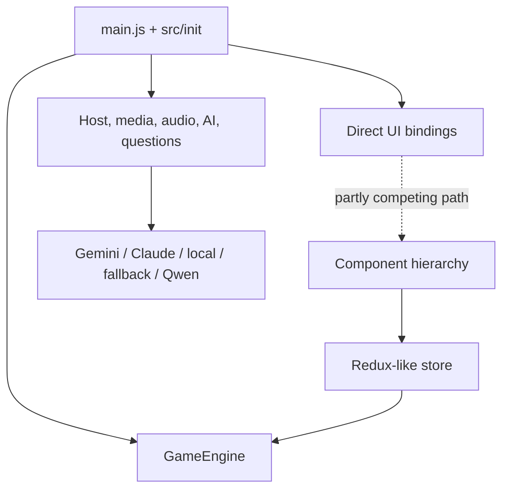

# JeoPARODY / Jeopardish Repository Truth Audit

**Prepared:** 2026-07-28  
**Decision scope:** Repository identity, executable ownership, donor preservation,
and the safest path to one canonical JeoPARODY product.

## Executive Verdict

The concern behind this audit is correct: the original plan treated the
`JeoPARODY` repository as the future architecture and `Jeopardish` as the
feature donor, but the active implementation strategy later changed.

The current situation is:

- **JeoPARODY is the product name and creative identity.**
- **The strongest current executable lives in the Jeopardish Git history** on
  `convergence/jeoparody-v3`.
- **The older JeoPARODY repository remains a valuable donor**, especially for
  PAO, AI-development experiments, fonts, audio, full-board research, and
  historical design work.
- **We should not start over and should not wholesale-merge either tree.**
- **We should make the repository identity match the product identity** after
  preserving the dirty donor work.

The recommended end state is to preserve the current JeoPARODY repository as a
clearly named legacy/donor repository, then rename the current executable
repository from `Jeopardish` to `JeoPARODY`. That preserves both histories,
avoids an unrelated-history merge, and removes the product/repository mismatch.

## What Changed

The June convergence plan said:

> JeoPARODY is canonical; rebuild selected Jeopardish behavior inside it.

That was a reasonable plan before production behavior was compared closely.
Later audits found that JeoPARODY's component/store architecture was appealing
on paper but was not consistently the live runtime. Its active path still mixed:

- direct DOM coordination;
- a state store and separate `GameEngine` state;
- multiple scoring and answer-validation implementations;
- component modules that the live shell did not consistently use;
- AI/provider experiments with browser credential risk;
- incomplete board and category-run surfaces;
- several competing CSS systems;
- a large production artifact and asset tree.

Meanwhile, the Jeopardish executable accumulated the behavior that mattered:

- one tested clue/answer/score loop;
- media preflight and replacement;
- full clue translation;
- responsive cabinet and visual-state fixtures;
- deterministic episodes and local resume;
- grounded Study mode and memory reinforcement;
- voice input and narration;
- host performance contracts;
- production browser, accessibility, visual, artifact, and deployment gates.

The technical strategy therefore became:

> Keep the live, proven Jeopardish executable; give it JeoPARODY's identity;
> mine the older JeoPARODY repository behavior by behavior.

That reversal is technically defensible. The process failure was not making the
repository switch explicit enough when it happened.

## Repository Map

| Role | Location | Remote | State on 2026-07-28 |
| --- | --- | --- | --- |
| Current executable | `/Users/alex/Documents/Codex/2026-05-24/prior-conversation-with-codex-conversation-role/Jeopardish` | `AlexBaldman/Jeopardish` | Clean, pushed `convergence/jeoparody-v3` at `efb794e` |
| JeoPARODY donor | `/Users/alex/coding/jeoparody` | `alexbaldman/JeoPARODY` | `cleanup/production-readiness` at `1f97c4d`, 3 commits ahead of `origin/main`, with substantial uncommitted work |
| Older Jeopardish worktree | `/Users/alex/coding/jeopardish` | `AlexBaldman/Jeopardish` | Stale `master` clone, behind remote and carrying a large uncommitted historical migration |
| JeoPARODY baseline clone | `/Users/alex/coding/jeoparody.old` | `AlexBaldman/jeoPARODY` | Clean baseline at `e71d0dc` |

The two extra clones are preservation evidence, not additional canonical
products. They must not receive new feature work.

## Timeline

Important milestones:

- `2026-05-08`: last committed JeoPARODY stabilization work.
- `2026-07-14` through `2026-07-26`: the Jeopardish executable gains the
  production cabinet, media, episode, Study, voice, build, and CI foundations.
- `2026-07-27` through `2026-07-28`: Optimal Prime adds the authored Season Zero
  episode, learning return loop, telemetry boundary, HostPacks, explicit
  presentation owners, and focused renderer views.

## Empirical Comparison

| Dimension | Current executable | JeoPARODY donor |
| --- | --- | --- |
| Automated tests | 219 passing | 72 passing |
| JS quality gate | Syntax and contract suite | ESLint passing |
| CSS quality gate | 4,834 lines, 683 rules, zero duplicate selectors | Stylelint passing; large competing in-flight layers remain |
| Production dependencies | None | Google/Firebase tree present |
| Production audit | 0 vulnerabilities | 6 vulnerabilities: 1 critical, 3 high, 2 moderate |
| Production artifact | Curated 35 MB artifact under a 38 MB ceiling | Existing `dist` occupies roughly 247 MB |
| Browser proof | Exact built artifact, Season Zero journey, media standby, Chromium/WebKit gates | Runtime state script exists; incomplete modes are primarily visibility/geometry tested |
| CI | Verify, exact-dist smoke, visual matrix, Pages deploy, post-deploy canary | Lint, unit tests, build; accessibility command cannot fail CI |
| Working tree | Clean and synchronized | Large uncommitted stabilization set |
| Content model | Versioned reviewed episode plus labeled archive fallback | Normalized archive service and starter/shard work |
| Gameplay ownership | Separate episode, round, scoring, Study, input, and presentation owners | Live DOM/init path coexists with component/store/service abstractions |
| AI policy | Deterministic host first; remote AI deferred behind a server boundary | Browser provider scaffolding, prompt builder, cache, fallback, Qwen tools |

Passing tests in the donor matter. They show that its scoring, validation,
translation, question-service, state-action, and AI-fallback ideas contain useful
work. The stronger test count in the current executable is not merely volume:
it covers complete browser and production journeys that the donor suite does not.

## Architecture Comparison

### Current Executable

Strengths:

- one owner per domain;
- deterministic offline fast path;
- no browser AI SDK or credential path;
- canonical clue truth stays separate from translated presentation and comedy;
- the exact production artifact is tested;
- authored content and archive compatibility are explicitly different.

Current debt:

- `app.js` and `Renderer` still need focused extraction;
- the visual art direction is not yet at the intended final quality;
- runtime fonts are fallback stacks rather than packaged, rights-reviewed fonts;
- production identity still uses temporary real-host-derived artwork;
- no live full-board, wager, PAO, or remote AI mode yet.

### JeoPARODY Donor

Strengths:

- Vite and ESM developer experience;
- meaningful modularization and a smaller in-flight bootstrap;
- PAO deck and quiz implementation;
- full-board selection research;
- AI prompt, provider, caching, fallback, and image-generation research;
- a large Korinna font and historical audio reference library;
- useful question-service parsing and shard work;
- achievements, settings, and component experiments.

Risks:

- the component/store architecture is not the sole live path;
- `GameEngine`, store, init modules, components, and direct DOM handlers can
  compete for ownership;
- full-board and category-run screens do not use one canonical round/outcome
  loop;
- browser secret ingestion remains in the dirty init work;
- revealed-answer scoring is not protected by the same one-way state machine;
- PAO rendering interpolates editable data through `innerHTML`;
- dormant Google/Firebase dependencies enlarge security and deployment scope;
- 246 MB of source assets are copied into a similarly large build;
- 3,696 additions and 1,793 deletions remain uncommitted across 29 tracked files,
  with additional untracked modules and documents.

## Feature Truth Matrix

| Capability | Stronger current owner | Decision |
| --- | --- | --- |
| Classic clue loop | Current executable | Keep |
| Explainable fuzzy answer matching | Current executable | Keep; donor tests may add fixtures |
| Reveal/no-credit behavior | Current `RoundKernel` and outcome facts | Keep |
| Authored episodes and provenance | Current executable | Keep |
| Local session and review queues | Current executable | Keep |
| Study pause and exact resume | Current executable | Keep |
| Memory reinforcement | Current executable | Keep |
| Translation integrity | Current executable | Keep |
| Media parsing, preflight, fallback, modal | Current executable | Keep |
| Voice input and narration | Current executable | Keep |
| Host personality contracts | Current HostPack system | Keep |
| Privacy-safe telemetry boundary | Current executable | Keep |
| Responsive cabinet and scenes | Current executable | Keep |
| Full-board format | JeoPARODY has broader prototype code | Reinterpret through current episode/kernel contracts |
| Category runs | JeoPARODY prototype | Reinterpret after full-board rules |
| PAO easter egg | JeoPARODY | Port behavior into an isolated lazy mode after sanitization |
| AI provider orchestration | JeoPARODY research | Reinterpret behind a server/provider gateway |
| Qwen image generation/editing | JeoPARODY development tool | Preserve as a separate creator tool, never core gameplay |
| Achievements | JeoPARODY scaffolding | Reinterpret as earned episode/mastery artifacts |
| Korinna files | JeoPARODY asset library | Audit licensing before packaging |
| Historical Trebek audio | JeoPARODY asset library | Preserve as research; do not ship without rights |
| Large archive shards | Both repositories | Keep one validated build-time content pipeline |
| JeoPARODY product name and lore | Both planning systems | Canonical identity |

## What Must Not Be Lost

Before repository cleanup, preserve these JeoPARODY donor areas:

1. `src/components/pao/` behavior and PAO persistence format.
2. `QwenImageService` generation and image-edit requirements.
3. `PromptBuilder`, provider fallback, caching, and circuit-breaker ideas.
4. `FullboardGameService` category grouping and date-selection requirements.
5. Korinna font files and their provenance for a licensing decision.
6. Historical host audio as a non-shipping research collection.
7. Question-service HTML-fallback detection, CSV/TSV validation, and shard
   manifest fixtures.
8. Achievements, settings, modal, and component accessibility ideas.
9. All uncommitted planning documents, runtime screenshots, and source indexes.

Preservation does not mean copying these implementations into the runtime.
Every port still needs an owner, security review, tests, and a rights decision.

## Canonical Decision

### Product

**JeoPARODY** is canonical.

### Executable

**The current `convergence/jeoparody-v3` tree is canonical.**

### Git History

Use the current Jeopardish history as the future product history. It contains
the production sequence and verified contracts we would otherwise have to
recreate.

### Donor

Preserve the current JeoPARODY history and dirty work as a legacy donor. Do not
merge its unrelated root history into the executable merely to make the graph
look unified.

## Recommended Repository Realignment

The cleanest route is:

1. Freeze new implementation briefly.
2. Create and push a dated preservation branch containing the dirty
   `/Users/alex/coding/jeoparody` state.
3. Preserve the stale `/Users/alex/coding/jeopardish` worktree on a dated archive
   branch because it contains the original learning/shard migration evidence.
4. Tag both donor baselines.
5. Rename the GitHub `JeoPARODY` repository to `JeoPARODY-legacy`.
6. Rename the GitHub `Jeopardish` repository to `JeoPARODY`.
7. Rename or recreate the local canonical checkout under an unambiguous
   `JeoPARODY` path and update its remote.
8. Review `convergence/jeoparody-v3`, then promote it to the canonical default
   branch.
9. Keep the donor ledger in the canonical repository and link every future port
   to its source commit.

GitHub repository renames normally preserve redirects, but remote names,
deployment settings, Pages configuration, and local automation must still be
verified after the change.

## Why Not Move The Current Tree Into The Old Repository?

Fetching the current branch into the old JeoPARODY repository would leave two
unrelated histories under one remote. Merging them with
`--allow-unrelated-histories` would manufacture a giant conflict-heavy commit
without improving the product. Replacing old `main` would also obscure the
donor's provenance.

Renaming the repositories preserves both histories honestly:

- the production lineage keeps its clean graph;
- the donor lineage remains searchable;
- the public project name becomes JeoPARODY;
- no code is rewritten merely to fix naming.

## Immediate Work Order

Repository identity is now the lead domino:

1. Preserve both dirty historical worktrees.
2. Confirm the repository rename/realignment with the owner.
3. Perform and verify the rename, remotes, Pages, and CI.
4. Resume the current presentation-ownership work with `ScoreboardView`.
5. Create bounded donor tickets for PAO, fonts, audio provenance, full-board
   rules, and the creator-side AI tool.

No new game architecture should be built in the donor JeoPARODY checkout.
No donor subsystem should be copied wholesale.

## Bottom Line

We did not accidentally spend July improving the wrong product. We improved the
stronger executable and already rebranded that executable as JeoPARODY in its
UI, content, lore, and roadmap.

We did, however, leave the stronger executable inside a repository still named
Jeopardish without making that strategic reversal sufficiently explicit. The
next action should correct the repository identity and preserve the older
JeoPARODY work, not restart the application.
