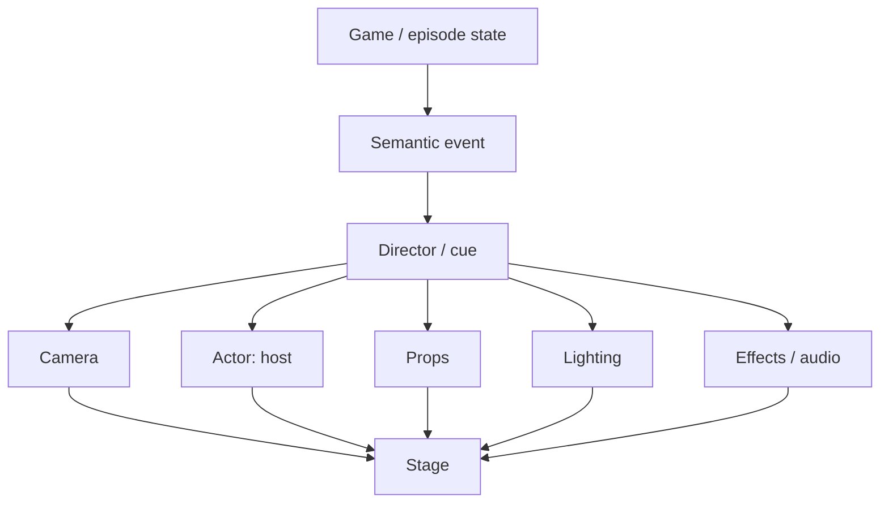

# JeoPARODY Stage Engine

**Implementation status:** the versioned semantic Stage cue and lifecycle slice
is implemented in `src/presentation/stage-director.js` and
`src/presentation/stage-engine.js`. Earlier branch experiments involving DOM
polling, duplicate fullscreen/theme ownership, and unmanaged choreography remain
reference material rather than the production path.

## Purpose

JeoPARODY should behave like an interactive game-show stage rather than a webpage full of independent widgets. This document defines the shared mental model and implementation seams for that evolution.

The stage model is intended to make responsive layout, host performance, animation, theming, immersive mode, skinnable controls, and future visual gags easier to add without coupling them to scoring or clue correctness.

## Core rule

The game determines **what happened**. The presentation layer determines **how the stage performs it**.



## Existing seams worth preserving

The current runtime already contains several pieces of this model:

- `src/host/host-performance-director.js` turns host beats into expression/motion/dialogue commands.
- `src/render/scene-service.js` owns environment scene packs and day/night scene selection.
- `src/presentation/broadcast-presenter.js` owns host/clue broadcast presentation.
- `src/presentation/cabinet-presenter.js` owns cabinet-level preference presentation.
- `src/core/event-bus.js` and event contracts provide a separation seam between game events and presentation.

The Stage Engine should extend these boundaries instead of rebuilding them wholesale.

## Stage

`StageEngine` owns presentation state that is safe to change without changing game correctness:

- responsive layout preset
- immersive state
- camera shot/target
- lighting mode/intensity
- scene name
- registered props
- visual skin registry
- latest semantic cue

The initial implementation lives at `src/presentation/stage-engine.js`.

## Responsive blocking

Responsive design is treated as stage blocking. The initial presets are:

| Preset | Intent |
| --- | --- |
| `desktopWide` | Use width intentionally, host and clue may share the stage comfortably. |
| `desktopCompact` | Keep theatrical spacing while reducing dead space. |
| `tablet` | Collapse secondary chrome and protect clue readability. |
| `mobilePortrait` | Clue dominates; host becomes contextual rather than permanently expensive. |
| `mobileImmersive` | Full-viewport phone blocking with compact header and controls. |
| `mobileLandscape` | Short-height composition with aggressive chrome reduction. |

Representative validation sizes: 393×852, 430×932, 375×667, mobile landscape, tablet, desktop, and large desktop.

## Stage zones

Semantic stage zones are available for future actor/prop blocking:

- upstage-left / center / right
- center-left / center / right
- downstage-left / center / right

These are intentionally semantic. They should resolve to geometry per blocking preset rather than becoming a new set of magic pixel coordinates.

## Camera

Initial shot vocabulary:

- wide
- medium
- close-up
- extreme-close-up
- peek
- offscreen

Camera state should be composable with host reaction/action. A host performance eventually becomes something like:

```js
stage.cue('wildlyWrongAnswer', {
  scene: 'reaction',
  camera: {
    shot: CameraShots.EXTREME_CLOSE_UP,
    target: 'host',
    intensity: 1.25,
  },
});
```

The camera is a presentation transform, not a route change or new page.

## Host actor model

Host performance should separate three axes:

1. **shot**: how the stage frames the host
2. **reaction**: facial/body emotional state
3. **action**: physical behavior such as stare, lean, point, pluck, eat, pop, recover

The existing HostPerformanceDirector already provides expression and motion primitives. Extend its command schema rather than introducing a competing source of truth.

Future example:

```js
{
  shot: 'close-up',
  reaction: 'suspicious',
  action: 'stare'
}
```

## Props and anchors

Anything the host can meaningfully interact with should be addressable as a prop. Initial candidates:

- clue card
- dialogue bubble
- score display
- response input
- game controls
- theme control
- sound control
- voice control
- immersive control

Props may expose semantic anchors such as `topLeft`, `topCenter`, `rightEdge`, or `tail`. This allows a future instruction like “host leans on dialogue bubble” to survive desktop/mobile layout changes.

## Skin system

Behavior and artwork must be separate.

A ThemeControl can be rendered as a pull-chain bulb, lava lamp, sun/moon diorama, desk lamp, porthole, blacklight, volcano, or future object without changing the theme-setting logic.

The initial `createSkinRegistry()` contract stores skins by semantic control type and skin id.

Potential skin metadata:

```js
{
  id: 'pullChainBulb',
  states: ['day', 'night'],
  assets: {},
  animations: {},
  sounds: {},
  effects: [],
  anchors: {},
  fallback: 'basicToggle'
}
```

### Asset guidance for illustrated controls

Recommended source-art contract for detailed pixel-illustration props:

- master art: 512×512 transparent canvas
- primary safe area: central ~80%
- standard anchor: bottom-center unless the prop requires another physical origin
- export derivatives as needed around 256, 128, and 64px
- static layers: PNG/WebP where appropriate
- geometry/UI primitives: SVG where appropriate
- animated interiors/effects: DOM/canvas/WebGL when procedural animation materially improves quality or file size

Do not force every asset through one format.

## Lighting

Initial lighting vocabulary:

- day
- night
- blacklight

Day/night already exists as a user preference and SceneService concept. The Stage Engine should become a presentation-level consumer of that same state rather than introducing a second theme preference.

Blacklight is intentionally modeled as a future modifier that may reveal `.uv-secret` elements and optional environmental layers. It should never hide required gameplay information.

## Immersive mode

Immersive mode has two layers:

1. **application immersive mode**: full visual viewport, reduced chrome, safe-area-aware stage blocking
2. **native Fullscreen API**: attempted when supported and appropriate

The application mode is the reliable foundation. Native fullscreen is an enhancement because browser support and behavior vary, especially on mobile Safari.

Use `100dvh`, `100dvw`, `viewport-fit=cover`, and safe-area insets. Always provide an obvious exit control and preserve keyboard/focus behavior.

## Motion tokens

Initial shared durations:

- instant: 0ms
- fast: 160ms
- normal: 320ms
- dramatic: 650ms

All theatrical motion must respect `prefers-reduced-motion`. Rare reactions and specialty skins should be lazy-loadable.

## Brand system

Brand hierarchy:

```text
jeoPAR[O]DY!
       ^
       only interchangeable letter slot
```

- `jeo`: quieter heritage layer
- `PARODY`: personality layer
- the O in PARODY: rotating novelty/mascot slot
- `!`: punctuation with attitude, especially useful for white-hot neon highlights

The visual language should match the current host artwork: high-detail pixel illustration, illustrated first and pixelated second.

### Night

Neon treatment with hot pink, orange, yellow, selective white highlights, controlled imperfect flicker, dark navy environment.

### Day

Premium yacht treatment using teak, brass, enamel, cream/navy accents, and warm daylight.

## First vertical slice

The first production integration should prove this path:

```text
clue loads
→ responsive Stage blocking
→ host default shot
→ player submits answer
→ game decides result
→ Director receives semantic result
→ camera / host / dialogue perform reaction
→ stage returns to clue/result state
```

At the same time, theme, sound, voice, and immersive controls should be expressed through semantic control contracts so later skins do not require new logic.

## Integration order

1. Load `stage-engine.js` and `stage-engine.css` in both `game.html` and the embedded game in `index.html`.
2. Instantiate one StageEngine from the application composition layer or a dedicated presentation bootstrap.
3. Bind it to `#gameContainer`.
4. Register key DOM props (`#speechBubble`, `#hostStage`, clue area, score, controls).
5. Add an accessible immersive/fullscreen button to header/menu and connect it to `toggleFullscreen()`.
6. Mirror the existing day/night preference into `stage.setLighting()`.
7. Route a single result presentation through a stage cue and camera shot.
8. Run the full verification suite and visual fixtures.
9. Only then broaden cues/skins.

## Stage Lab

`stage-lab.html` is a non-production visual fixture intended to accelerate implementation. It demonstrates:

- responsive layout classification
- mobile immersive behavior
- native fullscreen fallback behavior
- host close/extreme-close framing
- blacklight reveal concept
- prop registration
- semantic cue calls

It deliberately does not own game correctness.

## Deferred creative backlog

Preserve these as content/features to plug into the architecture after the first integration is proven:

- host leaning on dialogue bubble
- host plucking/eating/popping thought bubbles
- host pointing at player answer text
- scoreboard abuse/interactions
- rare reaction weighting
- host antics discovery collection
- detailed host facial close-up assets
- pull-chain bulb skin with chain physics and glow timing
- procedurally flowing lava-lamp skin
- blacklight Easter-egg library
- sun/moon diorama control
- articulated desk-lamp control
- volcano theme control
- additional interchangeable PARODY-O artwork
- yacht and neon logo render packs
- alternate environment packs and environmental audio

## Acceptance criteria for the foundational pass

The pass is successful when:

- existing game correctness remains intact
- the clue is visibly dominant on phone layouts
- immersive mode materially increases useful stage area
- host close-up is a reusable camera state rather than a bespoke page
- controls can change visual skins without changing their semantics
- the same scene can be blocked differently for desktop and mobile
- reduced motion remains usable
- adding the next strange visual idea requires adding content/skin/cue definitions more often than rewriting layout logic
