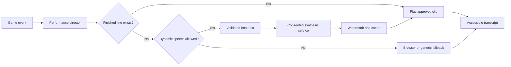

# Voice Production and AI Stack

**Status:** Canonical production guidance

**Updated:** 2026-08-07

JeoPARODY should sound performed, not generated. AI can expand a host's range,
but it should not sand away the timing, breath, restraint, and strange little
choices that make a character feel alive.

## Executive Decision

Use a three-tier voice system:

1. **Authored performance library** for introductions, reactions, scoring
   beats, transitions, and recurring jokes. Record real actors, preserve their
   best takes, and ship or stream finished audio.
2. **Consented character synthesis** for variable lines whose wording is not
   known in advance. Build only from recordings made for this purpose under a
   clear release.
3. **Browser or local fallback speech** when a character voice is unavailable.
   Label it as a fallback and keep gameplay fully usable without it.

The MVP should pre-render every line it can. This produces better comic timing,
lower latency, predictable cost, and fewer privacy surprises than attempting to
synthesize the entire broadcast live.

The runtime foundation now lives in `src/voice/voice-pack.js`. It validates
bilingual styles, fallback order, provider capabilities, provenance, usage
rights, and consent without embedding credentials or service endpoints. The
current `VoiceController` consumes that metadata but deliberately executes only
the proven browser speech adapter; local and neural descriptors remain disabled
until real approved assets and adapters exist.

## Recommended Free Development Stack

| Need | Recommended starting point | Why | Production caution |
| --- | --- | --- | --- |
| English and Portuguese character voice | [Qwen3-TTS](https://github.com/QwenLM/Qwen3-TTS) | Apache-2.0 implementation with English and Portuguese, voice design, style control, streaming, and short-reference cloning | Record consent, isolate the large local runtime, pin model/checkpoint versions, and audit every shipped checkpoint license |
| Secondary voice research | [Chatterbox](https://github.com/resemble-ai/chatterbox) | Useful independent comparison for multilingual reference-audio transfer | Preserve watermarking, verify Brazilian Portuguese quality, and audit code plus checkpoint licenses |
| Local speech recognition | [whisper.cpp](https://github.com/ggml-org/whisper.cpp) | Mature local transcription path with no required cloud round trip | Device performance varies; keep typed input first-class |
| Fast generic offline voice | [Piper](https://github.com/OHF-Voice/piper1-gpl) | Useful for accessibility and non-character fallback speech | GPL code and individual voice-model licenses require review and architectural isolation |
| Experimental expressive research | [F5-TTS](https://github.com/SWivid/F5-TTS) | Strong research baseline and useful prototyping reference | Current pretrained weights are noncommercial; do not build a commercial release around them |
| Hosted text generation during private alpha | [Gemini API free tier](https://ai.google.dev/gemini-api/docs/pricing) behind a server boundary | Low-cost way to test Topic Shows and host dialogue | Free-tier content may be used to improve products; never send private voice recordings, secrets, or unpublished sensitive material |
| Key-safe prototype gateway | [Cloudflare Workers](https://developers.cloudflare.com/workers/platform/pricing/) | A small free allowance is enough for a thin authentication, quota, and validation proxy | It is a gateway, not a database or long-running generation worker |

"Free" here means suitable for local development or a small private test. It
does not mean unlimited, supportable, or automatically cleared for a commercial
product.

## Recording Standard

Every custom host voice should have:

- a signed actor release naming the character, intended uses, editing rights,
  synthesis permission, revocation terms, and compensation;
- an unambiguous ban on impersonating an unconsenting real person;
- clean 48 kHz mono WAV masters, plus untouched source recordings;
- neutral, excited, disappointed, conspiratorial, instructional, and
  rapid-response takes;
- phonetic coverage for names, dates, money, abbreviations, English, and
  Portuguese;
- a voice manifest containing actor, consent version, model, checkpoint,
  settings, source hashes, and generated-output hashes.

Friendship is not a rights-management system. Even friends should sign the
same plain-language release an outside actor would receive.

## Runtime Architecture



The game engine emits semantic events such as `clue.presented`,
`answer.correct`, or `study.paused`. It never selects audio files or calls a
model. The performance director decides the beat; the voice adapter decides how
to realize it. This keeps gameplay deterministic when voice services are slow
or absent.

## Speech Input

Voice answers and controls should remain a progressive enhancement:

- push-to-talk by default;
- a visible listening state and an immediate cancel action;
- transcription shown before a risky command is committed;
- tolerant answer matching applied to the transcript exactly as it is to typed
  text;
- local recognition when practical, with clear disclosure before cloud
  transcription;
- keyboard, touch, and screen-reader parity for every voice command.

Never let background speech silently trigger "reveal answer," "new clue,"
purchase, account changes, or deletion.

## Host Dialogue Generation

Dynamic host writing should pass through this pipeline:

```text
game facts + current beat + learner state
              |
              v
structured dialogue request
              |
              v
host voice guide + prohibited claims + length budget
              |
              v
candidate lines
              |
              v
factual grounding + repetition + safety + timing checks
              |
              v
approved text -> voice realization
```

The model can choose wording. It cannot change the correct response, score,
source facts, learning state, or episode progression. Jokes must be disposable;
truth must not be.

## Topic Show Boundary

Topic Show generation should run on a server or trusted local process, never
from a public browser holding an API key. The service should:

1. turn the player's topic into a research plan;
2. gather source-backed fact packets;
3. generate multiple clue candidates from those packets;
4. reject ambiguous, unsupported, duplicate, or answer-leaking clues;
5. assemble a temporary show with provenance attached to every clue;
6. store only what the player explicitly saves.

Generated Topic Shows must never be silently mixed into the reviewed editorial
catalog.

## Rollout

**MVP:** browser speech recognition/synthesis fallback, typed parity,
actor-recorded core reactions, transcript captions, and a disabled-by-default
synthesis adapter.

**Private alpha:** consented Chatterbox character prototype, pre-render cache,
whisper.cpp input experiment, and quality/latency measurements on real phones.

**Paid release:** reviewed model and voice licenses, explicit privacy policy,
server quotas, abuse controls, per-line provenance, actor compensation policy,
and a kill switch that leaves the game playable.

## Acceptance Gates

- Voice-off gameplay is complete and equally understandable.
- No private recording leaves the device without explicit consent.
- Every synthesized character can be traced to a valid release and model
  manifest.
- The host cannot alter scoring or factual truth.
- Dynamic audio failure never blocks a clue.
- English and Brazilian Portuguese are tested by native speakers.
- Generated speech is captioned and interruptible.
