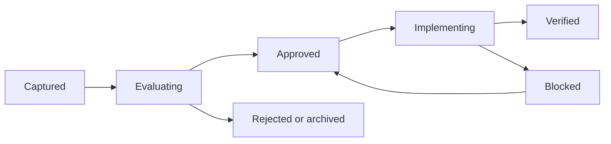

# Canonical Convergence Control Plane

This directory is the operational answer to “how do we combine the best parts
without making another tangled rebuild?”

The canonical product is **JeoPARODY**. The canonical executable is the current
`convergence/jeoparody-v3` runtime. Everything else is a donor, reference,
fixture source, or historical record.

## Working Rule

No donor code enters the canonical runtime merely because it exists or looks
more modular. A candidate moves forward only when the registry identifies:

1. the exact source repository, revision, and path;
2. the behavior or requirement worth preserving;
3. the existing canonical owner that receives it;
4. dependencies and risks;
5. acceptance criteria proving parity or improvement;
6. evidence after verification;
7. what happens to the superseded implementation.

## Workflow



Only one candidate may be `implementing` at a time. This keeps the lead domino
visible and prevents half-integrated systems from competing for ownership.

Statuses mean:

| Status | Meaning |
| --- | --- |
| `captured` | Preserved and named; no implementation decision |
| `evaluating` | Comparing behavior, architecture, evidence, and risk |
| `approved` | Target owner and acceptance criteria are agreed |
| `implementing` | The sole active convergence change |
| `blocked` | Approved work has a named external or dependency blocker |
| `verified` | Acceptance evidence exists and superseded behavior is resolved |
| `archived` | Valuable research or history; no runtime work planned |
| `rejected` | Conflicts with canonical contracts or product direction |

## Priority Queue

The registry is ordered by leverage and dependency:

1. `SEC-001`: sanitize the donor credential path and scan all refs.
2. `OPS-001`: turn preserved dirty work into reviewable thematic evidence.
3. `CORE-001`: finish focused presentation ownership in the canonical runtime.
4. `ASSET-001`: establish a rights-reviewed production asset manifest.
5. `PAO-001`, `FORMAT-001`, and `AI-001`: integrate bounded product systems
   through canonical contracts.
6. `CONTENT-001`: mine only missing historical content-pipeline fixtures.

Priority does not override dependencies. A visually exciting candidate stays
captured until the systems it depends on are verified.

## Updating The Registry

Use `TICKET_TEMPLATE.md` for investigation notes or implementation plans. Then
update `registry.json` in the same change.

Run:

```bash
npm run validate:convergence
```

The validator rejects duplicate IDs, unknown states, missing provenance,
dependency cycles, unsafe credential-shaped values, finished work without
evidence, and more than one active implementation.

## Decision Boundaries

- Do not merge unrelated histories.
- Do not start feature work in donor worktrees.
- Do not create a second owner for scoring, rounds, episodes, Study, input,
  localization, media, presentation, or preferences.
- Do not copy generated assets into production without provenance and rights.
- Do not let AI rewrite canonical clue or answer truth.
- Do not mark work verified because it compiles; attach the acceptance evidence.

The donor ledger remains the broad comparative record. This registry is the
live queue and must stay smaller, stricter, and current.
