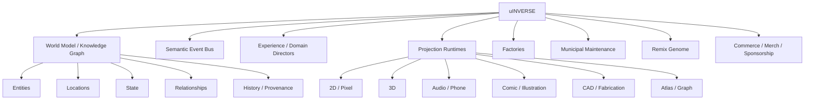
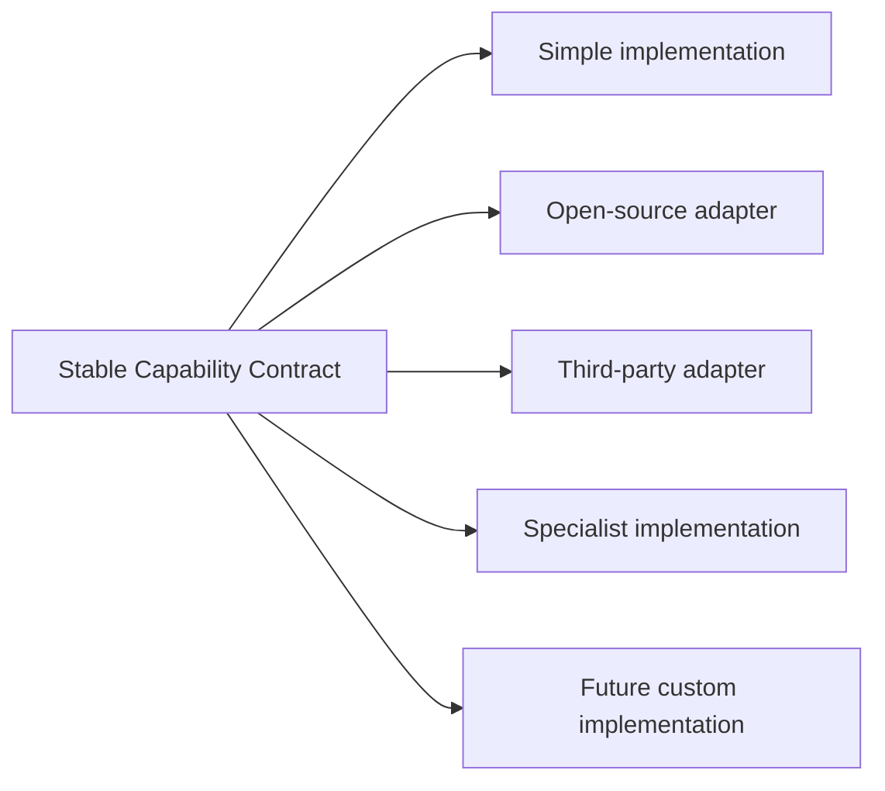
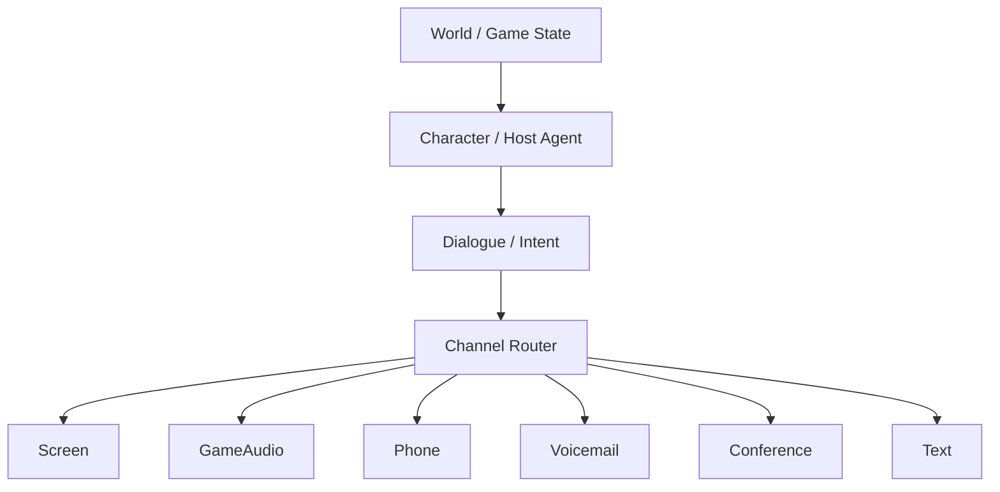
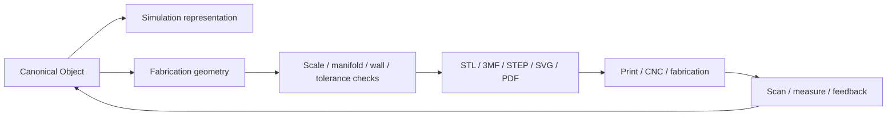
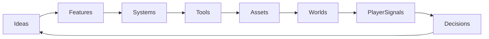

# uINVERSE Canonical Architecture

**Date:** 2026-08-08  
**Status:** proposed canonical synthesis  
**Purpose:** compress the current brainstorm into the smallest set of durable abstractions that can support Jeopardish, jeoPARODY, the Florida world, Memory Universe, Brazillionaire, You in Verse, sports/game surfaces, fabrication, merch, media, and future worlds.

## Design doctrine

1. **Do not put a hat on a hat.** Avoid ornamental abstractions and redundant wrappers.
2. **Do not rebuild the wheel unless the wheel is the problem.** Prefer proven engines, libraries, algorithms, plugins, standards, and adapters.
3. **Own the concepts and contracts; rent or swap the implementations.** Canonical data must survive engine changes.
4. **Capture first, abstract second.** Brainstorm freely, then consolidate repeated ideas into primitives and factories.
5. **Every useful tool should make the next tool easier to build.** Recursive tooling is a first-class goal.
6. **Quarantine before deletion.** Maintenance automation should be aggressive about finding waste and conservative about destroying it.
7. **A world object is not its rendering.** Pixel art, 3D, audio, CAD, physics bodies, prose, and fabrication are manifestations of one semantic object.

## The stack



## Canonical entity principle

A canonical object owns identity and semantic truth. Engines receive projections of that truth.

```ts
type CanonicalObject = {
  id: string;
  kind: string;
  dimensions?: {
    width: number;
    height: number;
    depth: number;
    unit: "mm" | "cm" | "m" | "in";
    confidence?: number;
  };
  anchors?: Record<string, [number, number, number]>;
  surfaces?: Record<string, SurfaceDefinition>;
  materials?: MaterialZone[];
  relationships?: Relationship[];
  manifestations?: ManifestationRef[];
  provenance?: Provenance[];
};
```

Example: a boombox can have one identity and multiple manifestations:

```text
BOOMBOX_001
├── pixel sprite
├── illustrated prop
├── realtime 3D mesh
├── Rapier collision/body representation
├── parametric CAD representation
├── printable STL/3MF
├── audio/media-player behavior
└── merch/collectible metadata
```

Pixel art is a view of the boombox, not the dimensional source of truth.

## Stable interfaces, replaceable organs



Examples:

- `PhysicsAdapter` → Rapier, Box2D, Jolt, domain-specific simulator.
- `RendererAdapter` → DOM, Canvas, Phaser, Three/R3F, Babylon, Godot prototype.
- `MediaAdapter` → local audio, radio, Spotify-like provider.
- `CommunicationChannel` → browser mic/TTS, phone, voicemail, conference call.
- `FabricationAdapter` → OpenSCAD-like parametrics, FreeCAD workflow, mesh tools, slicer.
- `MapAdapter` → fictional graph, GIS, Google Maps layer, handcrafted map.

## World packs

Games are packages installed into the shared substrate.

```ts
type WorldPack = {
  id: string;
  locations: string[];
  characters: string[];
  systems: string[];
  ruleSets: string[];
  assetPacks: string[];
  entrances: string[];
};
```

Candidate packs:

- Jeopardish / jeoPARODY studio
- Florida marina / Dockhand
- 8 Ball Pool Hall
- Golf world and learning stations
- Memory Universe
- Brazillionaire
- You in Verse
- future board/card/sports/combat worlds

## District model

The world metaphor doubles as product architecture.

```text
CHARACTER DISTRICT
  avatar creator, faces, hair, bodies, rigging, animation, identity

GARMENT DISTRICT
  wardrobe, layering, colorways, merch, skins, fabrication handoff

ITEM FACTORY
  props, tools, weapons, boards, decals, metadata, crafting

LEVEL & MAP DISTRICT
  terrain, scenes, tiles, GIS, procedural generation, prefabs, portals

MEDIA DISTRICT
  radio, jukeboxes, boomboxes, stereos, phones, voices

BUSINESS OFFICES
  campaigns, sponsors, offers, analytics, publishing, licensing

PUBLIC WORKS
  sanitation, roads, utilities, building inspection, archives, repair

EXCAVATION STATION
  repository archaeology, dead branches, prototypes, recovered ideas

FABRICATION YARD
  CAD, mesh repair, scale, tolerances, print/export, digital twins
```

## Host and director architecture

Hosts are data-driven behavioral packages rather than skins.

```ts
type HostProfile = {
  id: string;
  tier: "core" | "guest" | "secret" | "event";
  visuals: string;
  dialogueRules: string;
  voice?: string;
  ruleModifiers?: string[];
  music?: string;
  uiBehaviors?: string[];
  unlock?: SecretTrigger;
};
```

Creative-director lenses are composable high-level technique profiles affecting pacing, visual-gag density, deadpan, sentiment, surrealism, recursion, callbacks, and fourth-wall permeability. Current reference set includes Spielberg, Louis C.K., Zucker brothers, Mel Brooks, Fred Savage, Woody Allen, Charlie Kaufman, and David Lynch. These are internal creative abstractions, not exact style-copy mechanisms.

## Secret system

Secret inputs should be a reusable world primitive.

```ts
type SecretTrigger =
  | { kind: "input-sequence"; sequence: string[] }
  | { kind: "phone-number"; id: string }
  | { kind: "radio-token"; id: string }
  | { kind: "world-action"; actions: string[] }
  | { kind: "inventory-combination"; items: string[] }
  | { kind: "time-rule"; rule: string }
  | { kind: "director-mix"; signature: string };
```

Classic console codes, pool-shot sequences, hidden phone numbers, sunglass reflections, radio stings, environmental clues, fake manuals, and strange host remarks can all feed the same secret registry.

## Media and phone as world channels



Music and communication should be diegetic. Jukeboxes, car stereos, boat stereos, boomboxes, radios, arcade cabinets, and phones are world objects that expose shared interfaces.

## Physical-world bridge



Simulation and manufacturing geometry remain separate specialists connected by shared dimensions, transforms, attachment points, materials, and constraints.

## Cards and boards

Card and board games should be built from primitives:

```text
decks, cards, hands, piles, hidden information, drafting, shuffling
boards, spaces, adjacency, zones, tokens, dice, turns, phases
actions, resources, scoring, effects, movement, ownership, rule resolution
```

This lets trivia, memory systems, strategy games, classic games, educational stations, and hybrid physical/digital games share infrastructure.

## Living Project Graph

The project itself is modeled as graph data.



Nodes can include concepts, files, tasks, constraints, bugs, assets, characters, locations, sponsors, offers, tools, and research candidates. Edges carry dependency, provenance, reuse, inspiration, blockage, and history.

The system should surface the node or edge where intervention creates the greatest constructive downstream change.

## Architecture litmus test

Before adding a layer, ask:

1. Is this a new concept, or another name for an existing primitive?
2. Does a mature implementation already exist?
3. Can we adapt it behind a stable contract?
4. Will this abstraction have at least two real consumers soon?
5. Does the layer reduce coupling or merely move it?
6. Can the city workers validate and maintain it automatically?
7. Does it produce something visible or useful quickly?

If several answers are bad, remove the hat.