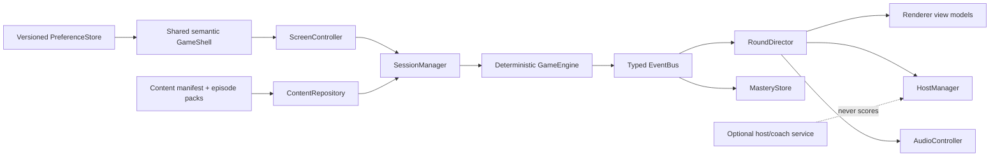
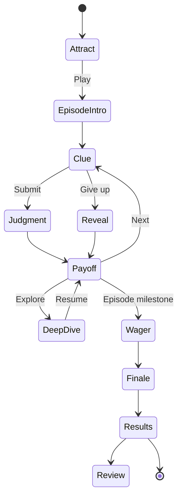

# JeoPARODY Design and Architecture Audit - 2026-07-14

## Executive Verdict

JeoPARODY now has a distinctive game cabinet and a credible visual identity. The standalone game is the strongest product surface: it fits a desktop or phone viewport, makes the clue the visual center, and feels more like a game than a website. The next risk is no longer generic styling. It is that a polished cabinet is wrapped around an endless random-clue prototype with duplicated markup and an 88 MB static payload.

The product should stop adding equal-weight surfaces and build one complete Season Zero episode. Ten curated clues, one wager, one finale, one result artifact, and one saved session will improve the opening, game, menu, score drawer, host reactions, and return loop at the same time.

## Audit Scope

Rendered at 1440x900 and 390x844 with reduced-motion enabled:

- Landing hero and primary navigation
- Evidence, premise, format, trust-boundary, signal-map, sparks, and roadmap sections
- Embedded game cabinet
- Standalone dark and light cabinets
- Clue, reveal controls, all four dialogue skins, score drawer, and game menu
- Mobile clue and mobile menu
- Clue-media modal
- Creative Room desktop and mobile layouts
- Asset Gallery
- Empty, loading, correct, incorrect, translated, fallback, and media-failure behavior through code and tests

The final pass has no horizontal overflow on the landing page, standalone game, Creative Room, or Asset Gallery at the tested widths. The standalone game remains contained to one viewport.

## Screen Verdicts

| Surface | Verdict | Keep | Improve next |
| --- | --- | --- | --- |
| Landing hero | Strong | Clear fictional premise, premium hero art, confident title | Put `Play` ahead of the strategy document; shorten the first-session path |
| Evidence and premise | Good | Corpus scale and truth/theater distinction | Collapse deeper proof into progressive disclosure after the first two sections |
| Experience formats | Good concept | Study, Arcade Story, and Classic Strategy are useful product lenses | Do not present three launchable products until one episode exists |
| Signal maps | Fixed | Diagrams now work offline and expose Mermaid source | Replace the source expander with locally rendered Mermaid when dependencies are vendored |
| Embedded cabinet | Useful demo | Shows the product without navigation | Treat as an attract-mode preview; direct serious play to the standalone cabinet |
| Standalone cabinet | Best surface | Centered clue, fixed viewport, vivid controls, theme and scene system | Add episode progress, question count, pause, and results instead of more skins |
| Mobile cabinet | Good | No body scrolling, readable clue, stable footer | Preserve labeled round buttons and test 320px width plus landscape |
| Score drawer | Good | Hidden-until-needed behavior and flip treatment | Show episode progress and value delta, not only lifetime-style counters |
| Game menu | Good | Clear sections and strong slide-out presentation | Add explicit previous/next background controls and a small scene preview |
| Dialogue skins | Fun but overexposed | Four useful storytelling modes | Move skin cycling into Creative/Settings mode during normal play |
| Host selector | Useful prototype tooling | Fast visual comparison | Hide arrows in production mode; expressions should follow game state automatically |
| Media viewer | Fixed | Accessible modal structure now exists on both game surfaces | Add local/proxied production media and caption/transcript metadata |
| Portuguese mode | Valuable | Complete clue translation path and English source retention | Make translation availability explicit before play and cache episode translations |
| Correct/incorrect payoff | Functional | Distinct deterministic outcomes | Give each result a short staged beat, explanation, and one clear continue action |
| Creative Room | Strong internal tool | Cohesive identity lab and selectable directions | Add a compact comparison/export state; keep it out of the main player journey |
| Asset Gallery | Useful internal inventory | Honest production/archive grouping | Add filters, full-size modal inspection, alpha status, dimensions, and duplicate badges |

## Fixes Landed In This Pass

- Promoted `Long Beach '96` to the default scene for new players while preserving saved choices.
- Added the missing clue-media modal to standalone play.
- Replaced raw Mermaid text on the landing page with semantic visual flow diagrams and collapsible Mermaid source.
- Made landing content visible by default so partial JavaScript failure does not erase the page.
- Removed Asset Gallery horizontal overflow caused by long archival filenames.
- Enlarged repeated cabinet and Creative Room controls.
- Added persistent mobile labels for New Clue and Reveal Answer.
- Updated stale `01/02` scene indicators to `01/03`.
- Added static shell-contract tests for cabinet IDs, media parity, duplicate IDs, scene count, diagrams, and progressive content.

## Architecture Findings

### 1. The Cabinet Has Two Owners

The complete cabinet markup lives in both `index.html` and `game.html`. The missing standalone media modal and stale scene count were direct consequences. Static contract tests now catch critical drift, but the long-term fix is a build-time game-shell partial that generates both entry points.

Do not convert the cabinet to runtime string templates. The page should retain semantic HTML before JavaScript starts.

### 2. The Prototype Has No Session Product

`GameEngine` correctly owns clue truth and scoring, but `app.js` still selects random clues indefinitely. There is no episode contract, progress, finale, result, resume, or review queue. This is the largest gap between a polished prototype and a game people return to.

### 3. Coordination Files Are Becoming New Monoliths

`app.js` is roughly 770 lines and `renderer.js` roughly 930 lines. Existing module boundaries are sound, but preferences, clue selection, localization coordination, host direction, modal behavior, and screen state are accumulating in two files.

The next extractions should be behavioral, not cosmetic:

- `SessionManager`: episode order, progress, resume, finale, completion
- `PreferenceStore`: versioned settings and migrations
- `ContentRepository`: manifests, shards, schema, curated packs
- `GameShell`: shared semantic cabinet partial and DOM contract
- `ScreenController`: attract, playing, paused, deep dive, payoff, results

### 4. The Payload Is Content-Dominated

The static build is about 88 MB and still ships the full archive question JSON. Scene images are large but intentional; the archive should not be a first-load dependency. A manifest plus curated episode packs and lazy archive shards will improve startup more than micro-optimizing JavaScript.

### 5. Remote Presentation Dependencies Are Fragile

The current typography links to Google Fonts. The app has sensible fallbacks, but public builds should self-host approved font files or use a deliberately designed system-font fallback. Diagram presentation is now offline-safe; future Mermaid rendering should also be vendored rather than CDN-only.

## Target Ownership

## Desired Player Flow

## Lead Domino Order

### 1. Build One Real Episode

Create a ten-clue Season Zero pack with explanations, sources, accepted-answer rules, one wager, one finale, and one evidence artifact. Add `SessionManager` and progress UI. This converts every existing screen from a demo into a coherent journey.

### 2. Extract The Shared Game Shell

Create a build-time partial and generate the embedded and standalone shells. Keep the new contract tests. Allow explicit variants such as `embedded` and `standalone` rather than copying markup.

### 3. Add Pause And Deep Dive

Snapshot the deterministic round, detach a coach panel, ground answers in the active clue packet, then resume without changing score state. This should be a real screen state, not a modal bolted onto random play.

### 4. Ship Content Packs, Not The Archive

Build and validate a manifest, package Season Zero eagerly, lazy-load archive shards, and preflight media at build time. The archive remains source material rather than the product payload.

### 5. Add Browser Release Gates

Run desktop, narrow mobile, keyboard, reduced motion, media, translation, fuzzy answer, correct, incorrect, reveal, resume, and finale flows in CI. Add an asset budget and fail builds that reintroduce horizontal overflow or shell-contract drift.

## Design System Direction

Keep three related but distinct layers:

1. **Broadcast site:** editorial hierarchy, cream typography, restrained neon, long-form persuasion.
2. **Game cabinet:** bright illustrated stage, hard-edged controls, one dominant clue panel, minimal chrome during play.
3. **Creative lab:** dense comparison tools, dossiers, audit metadata, and selectors unavailable to ordinary players.

Share color, typography, spacing, focus, motion, and elevation tokens. Do not force all three surfaces into the same component density.

## Release Bar

- A new player reaches a meaningful clue in under two deliberate actions.
- A complete episode has a beginning, escalation, finale, and memorable result.
- Every clue has source, explanation, media health, and accepted-answer policy.
- All player controls meet practical touch-target requirements.
- No supported viewport has horizontal overflow or requires page scrolling during a clue.
- A refresh resumes the active episode.
- Host performance can fail without affecting truth, score, or progression.
- Production builds do not ship the full raw archive or unapproved real-host likeness assets.
